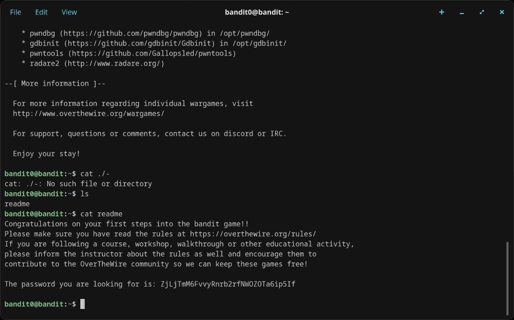

# Level 0 → 1

## Objective
Log into the Bandit server as `bandit0` and find the password stored in a file called `readme` in the home directory.

## Connection
```bash
ssh bandit0@bandit.labs.overthewire.org -p 2220
```
Password: `bandit0`

## Solution

Once logged in, list the files in the home directory:
```bash
ls
```
This reveals a file called `readme`. Read it with:
```bash
cat readme
```

The password for the next level is printed to the terminal.

## Password Found
`ZjLjTmM6FvvyRnrb2rfNWOZOTa6ip5If`

## What I Learned
- How to SSH into a remote server with a custom port (`-p 2220`)
- Basic navigation with `ls` and reading files with `cat`
- The Bandit environment has a MOTD (Message of the Day) explaining available tools

## Screenshots



