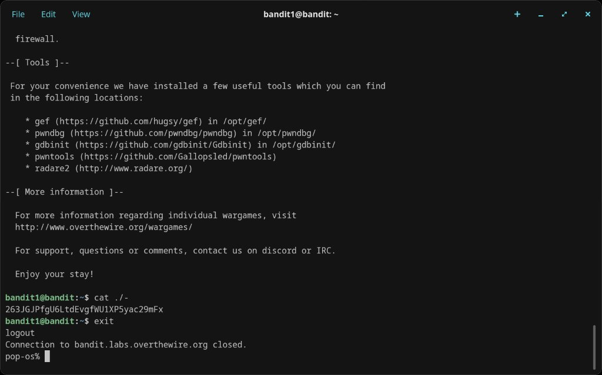

# Level 1 → 2

## Objective
The password is stored in a file called `-` in the home directory. Reading a file named `-` is tricky because the shell interprets `-` as stdin.

## Connection
```bash
ssh bandit1@bandit.labs.overthewire.org -p 2220
```
Password: `ZjLjTmM6FvvyRnrb2rfNWOZOTa6ip5If`

## Solution

Simply running `cat -` won't work — the shell treats `-` as standard input and just hangs. The fix is to prefix the filename with `./` to tell the shell it's a file path, not a flag:

```bash
cat ./-
```

The password is printed immediately.

## Password Found
`263JGJPfgU6LtdEvgfWU1XP5yac29mFx`

## What I Learned
- Files named `-` are a classic Linux gotcha — the shell treats bare `-` as stdin
- Prefixing with `./` forces the shell to treat the argument as a file path
- This technique (`./filename`) is useful any time a filename starts with a special character

## Screenshots

