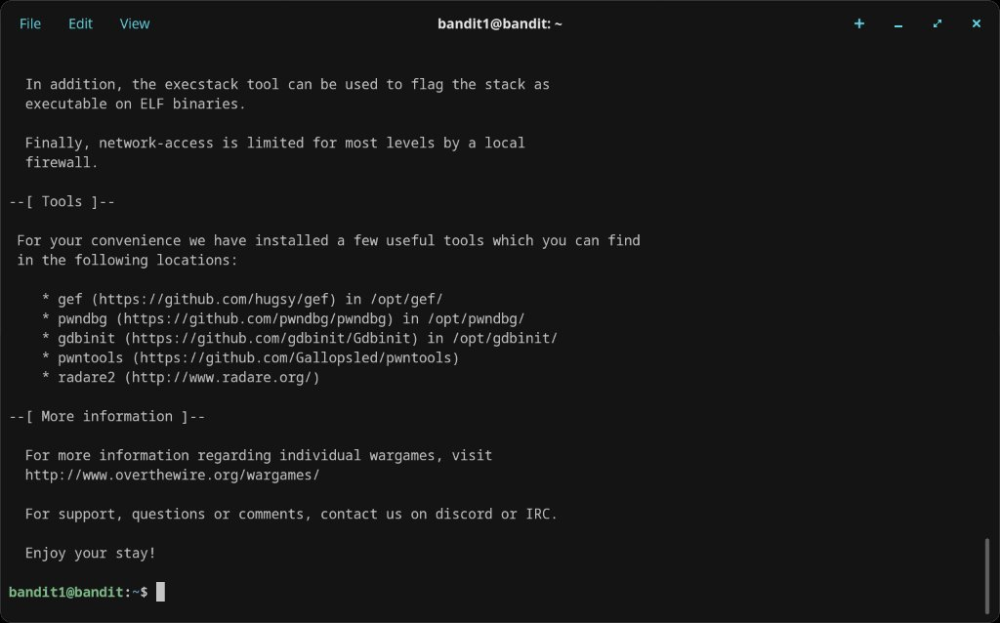
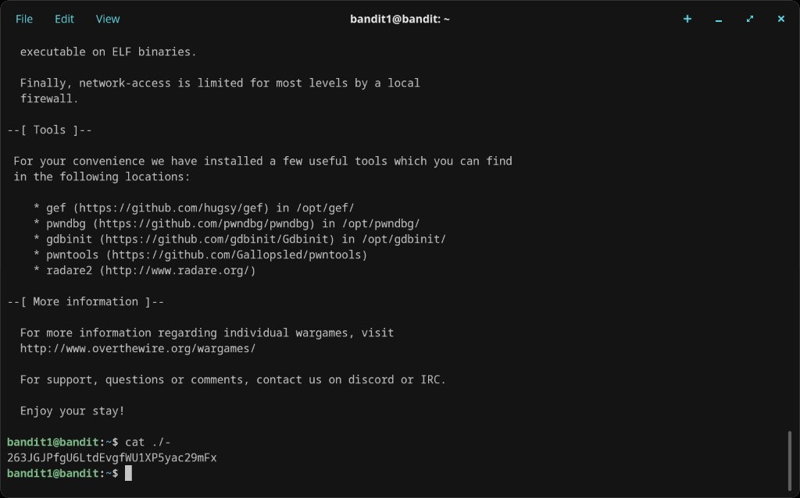

# Level 1 → 2

## Objective
The password is stored in a file called `-` (a dashed filename) in the home directory.

## Connection
```bash
ssh bandit1@bandit.labs.overthewire.org -p 2220
```
Password: `ZjLjTmM6FvvyRnrb2rfNWOZOTa6ip5If`

## The Problem
Running `cat -` doesn't work — the shell interprets `-` as stdin rather than a filename. Similarly, `cat ./-` initially seemed like the right approach but needed to be run correctly.

## Solution
Prefix the filename with `./` to explicitly tell the shell it's a file path, not a flag:
```bash
cat ./-
```

## Password Found
`263JGJPfgU6LtdEvgfWU1XP5yac29mFx`

## What I Learned
- Filenames starting with `-` are tricky because shells treat them as command flags
- Prefixing with `./` forces the shell to treat it as a relative file path
- This is a common gotcha in CTFs and real-world sysadmin work

## Screenshots



