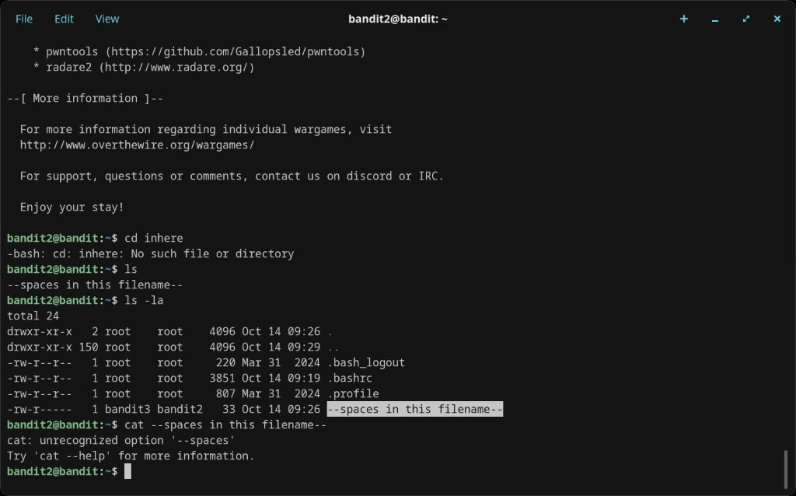
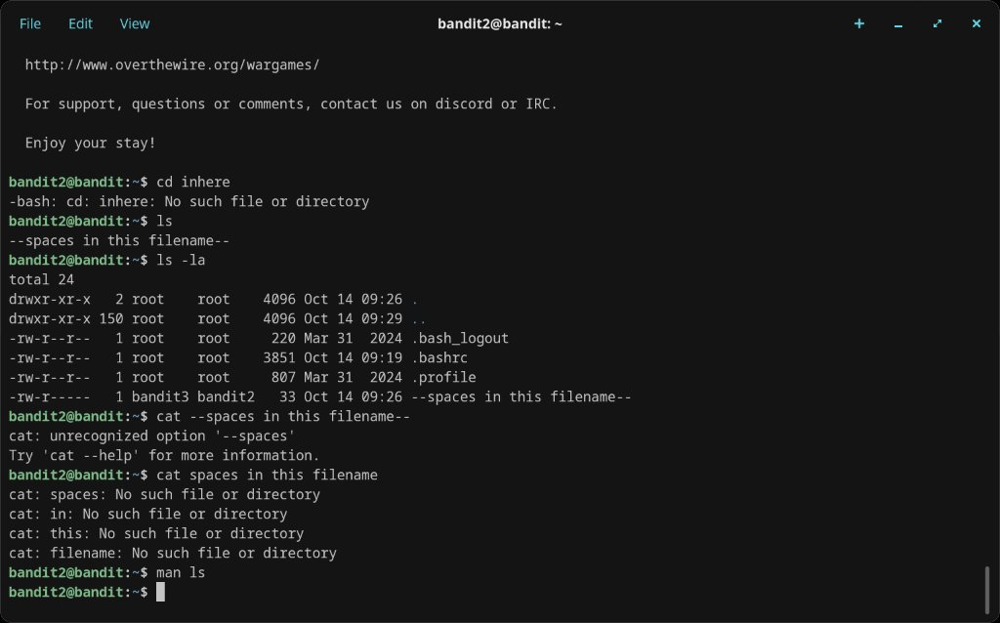
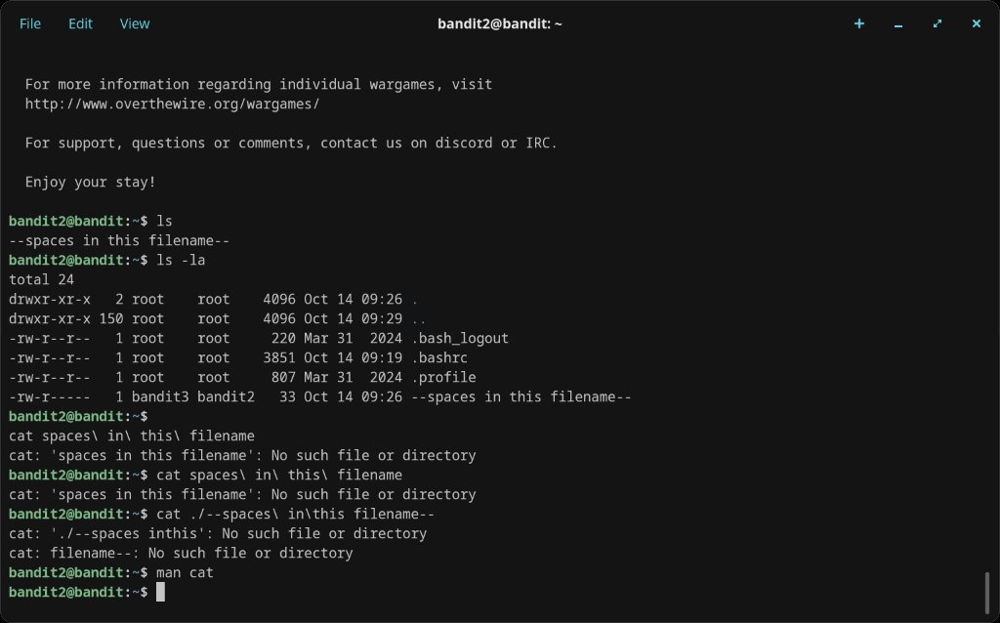

# Level 2 → 3

## Objective
The password is stored in a file called `--spaces in this filename--` in the home directory. Filenames with spaces require special handling.

## Connection
```bash
ssh bandit2@bandit.labs.overthewire.org -p 2220
```
Password: `263JGJPfgU6LtdEvgfWU1XP5yac29mFx`

## Solution

Running `ls` shows the file is called `--spaces in this filename--`. Several approaches fail:

```bash
cat --spaces in this filename--   # shell treats --spaces as a flag
cat spaces\ in\ this\ filename    # wrong name
cat ./--spaces\ in\ this\ filename--  # wrong escaping
```

After consulting `man cat`, the correct approach is to wrap the full filename in quotes:

```bash
cat "./--spaces in this filename--"
```

The password is printed.

## Password Found
`MNk8KNH3Usiio41PRUEoDFPqfxLPlSmx`

## What I Learned
- Filenames with spaces must be quoted or have spaces escaped with `\`
- Filenames starting with `--` are also tricky because shells may parse them as flags
- Combining both issues: wrapping in quotes with `./` prefix is the safest approach
- `ls -la` reveals full filenames including permissions and ownership

## Screenshots




