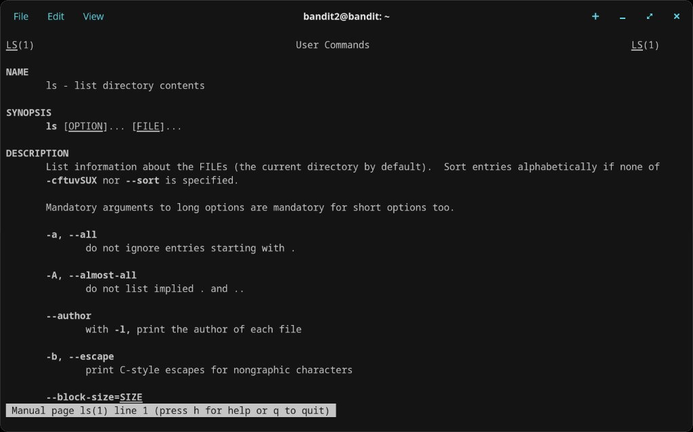
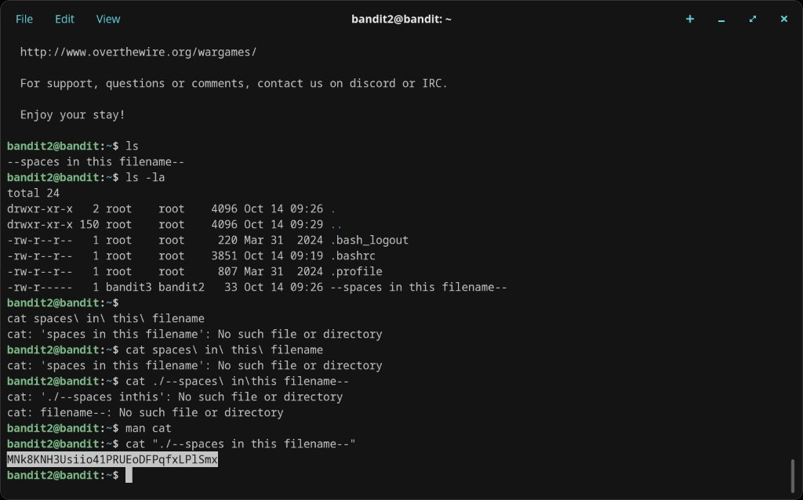

# Level 2 → 3

## Objective
The password is stored in a file called `--spaces in this filename--` in the home directory.

## Connection
```bash
ssh bandit2@bandit.labs.overthewire.org -p 2220
```
Password: `263JGJPfgU6LtdEvgfWU1XP5yac29mFx`

## The Problem
The filename contains spaces, which the shell treats as argument separators. Several approaches failed:

```bash
cat --spaces in this filename--   # Fails - shell treats --spaces as a flag
cat spaces\ in\ this\ filename    # Fails - still not finding the file
cat ./-spaces\ in\this\ filename  # Fails - mangled path
```

I also checked `man ls` and `man cat` trying to figure out the right approach.

## Solution
Wrap the full filename in double quotes so the shell treats it as a single argument:
```bash
cat "./--spaces in this filename--"
```

## Password Found
`MNk8KNH3Usiio41PRUEoDFPqfxLPlSmx`

## What I Learned
- Spaces in filenames need to be escaped or quoted
- Double-quoting the whole path (`"./filename with spaces"`) is the cleanest approach
- Backslash escaping each space also works but is error-prone with long names
- `ls -la` is useful for seeing exact filenames including hidden ones

## Screenshots





