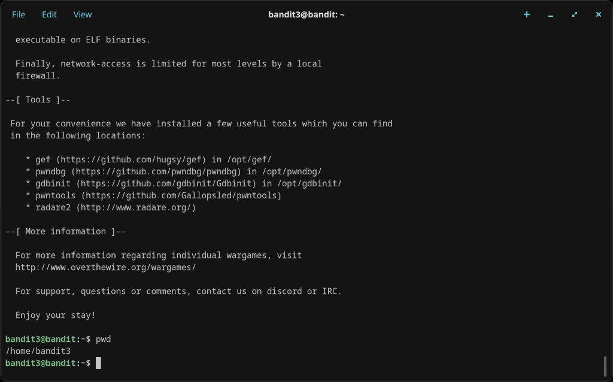
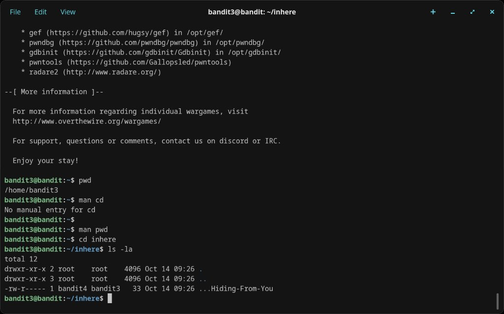
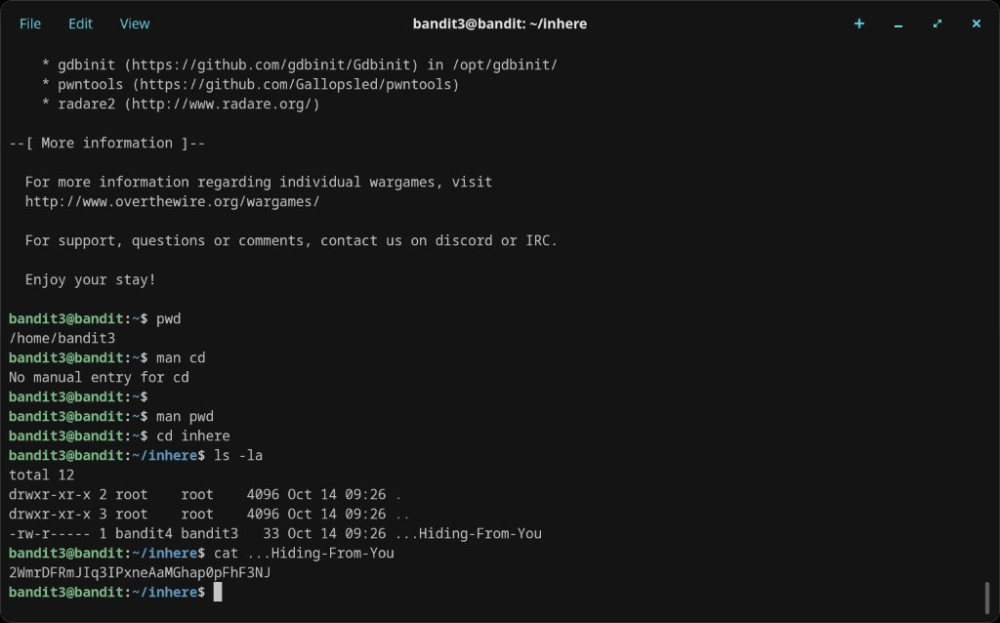

# Level 3 → 4

## Objective
The password is stored in a hidden file inside the `inhere` directory. Hidden files in Linux start with a `.` and are not shown by a plain `ls`.

## Connection
```bash
ssh bandit3@bandit.labs.overthewire.org -p 2220
```
Password: `MNk8KNH3Usiio41PRUEoDFPqfxLPlSmx`

## Solution

Navigate into the `inhere` directory and list all files including hidden ones:

```bash
cd inhere
ls -la
```

This reveals a hidden file called `...Hiding-From-You`. Read it:

```bash
cat ...Hiding-From-You
```

The password is printed.

## Password Found
`2WmrDFRmJIq3IPxneAaMGhap0pFhF3NJ`

## What I Learned
- Hidden files in Linux are prefixed with `.`
- `ls` without flags won't show them — use `ls -la` or `ls -a`
- `man cd` has no manual entry (cd is a shell builtin), but `man pwd` works
- Files can be named with multiple leading dots (like `...Hiding-From-You`)

## Screenshots



