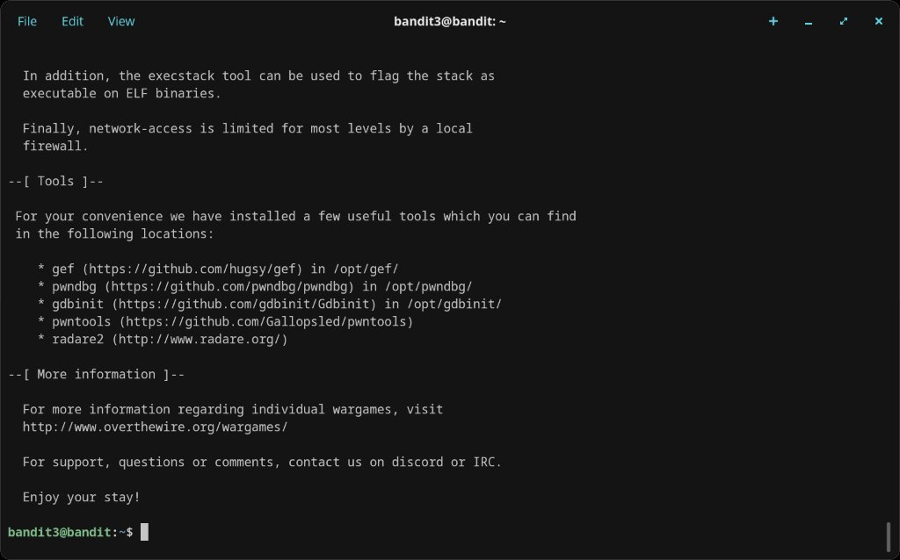

# Level 3 → 4

## Objective
The password is stored in a hidden file inside the `inhere` directory.

## Connection
```bash
ssh bandit3@bandit.labs.overthewire.org -p 2220
```
Password: `MNk8KNH3Usiio41PRUEoDFPqfxLPlSmx`

## The Problem
Running `ls` inside the `inhere` directory shows nothing — the file is hidden (prefixed with `.`).

## Solution
Use `ls -la` to show all files including hidden ones:
```bash
cd inhere
ls -la
```
This reveals a file called `...Hiding-From-You`. Read it with:
```bash
cat ...Hiding-From-You
```

## Password Found
`2WmrDFRmJIq3IPxneAaMGhap0pFhF3NJ`

## What I Learned
- Hidden files in Linux are prefixed with a `.` (dot)
- `ls` won't show them by default — use `ls -la` or `ls -a`
- Files can have unusual names like `...Hiding-From-You` — still readable with `cat`
- `pwd` confirms your current working directory if you get disoriented

## Screenshots



