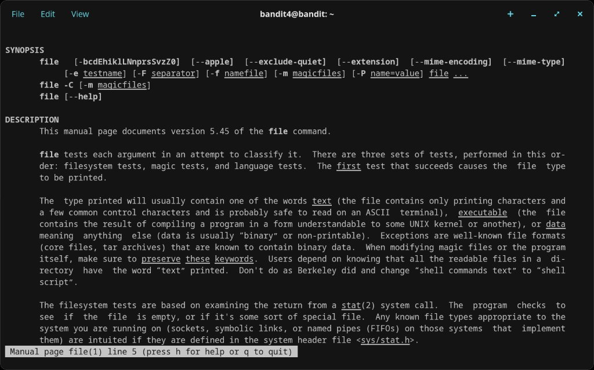
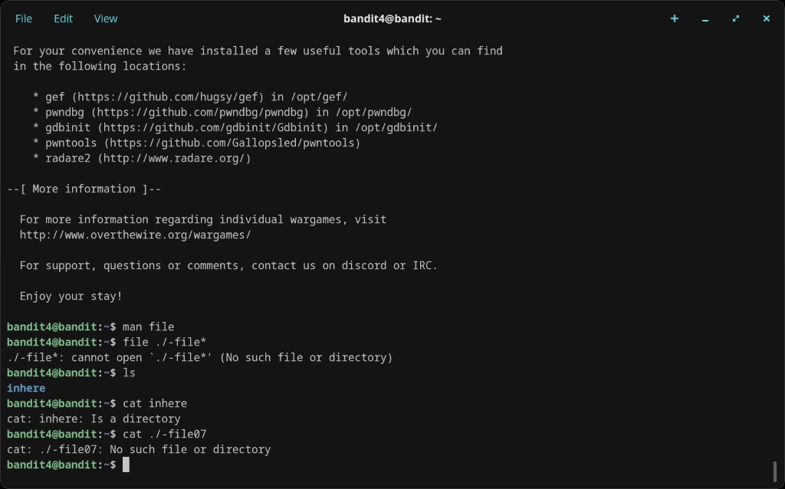
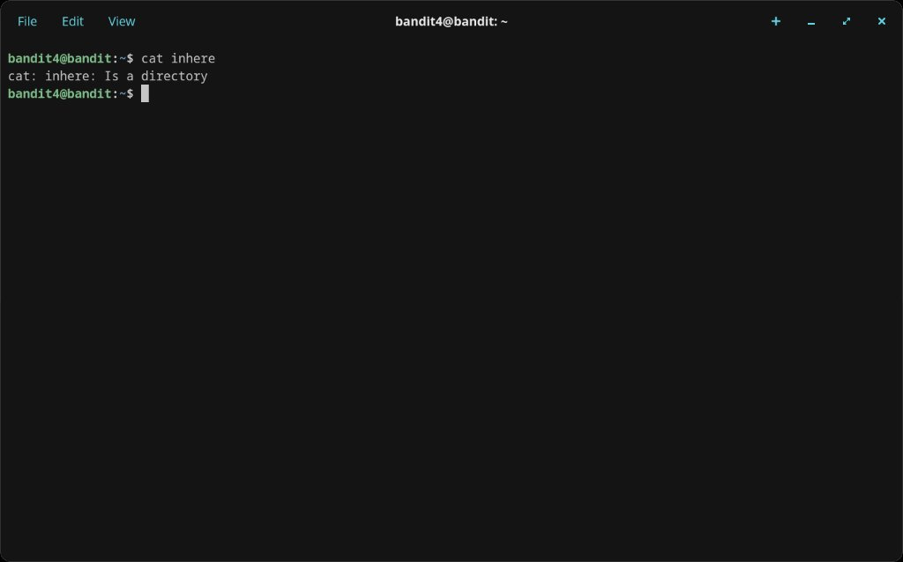
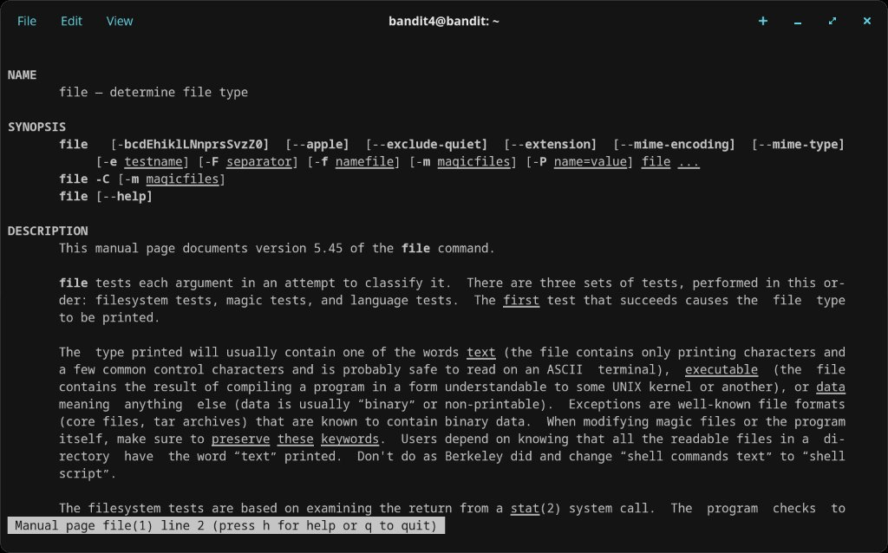
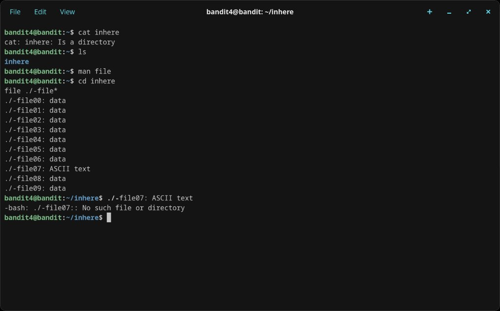

# Level 4 → 5

## Objective
The password is stored in the only human-readable file in the `inhere` directory, which contains files named `-file00` through `-file09`.

## Connection
```bash
ssh bandit4@bandit.labs.overthewire.org -p 2220
```
Password: `2WmrDFRmJIq3IPxneAaMGhap0pFhF3NJ`

## The Problem
There are 10 files in `inhere/` and most are binary data. Opening binary files with `cat` produces garbage output. We need to identify which one contains ASCII text.

Initial attempts from the home directory failed:
```bash
file ./-file*   # Fails outside the inhere directory
cat inhere       # Fails - it's a directory
cat ./-file07    # Fails - wrong directory
```

## Solution
Navigate into `inhere/` first, then use the `file` command with a wildcard to check all files at once:
```bash
cd inhere
file ./-file*
```
The output shows `./-file07: ASCII text` while all others show `data`. Read it with:
```bash
cat ./-file07
```

## Password Found
`4oQYVPkxZOOE0O5pTW81FB8j81xXGUQw`

## What I Learned
- The `file` command identifies file types based on content, not just the extension
- Using wildcards (`*`) with `file` lets you check many files at once efficiently
- Binary files show as `data`; readable ones show as `ASCII text`
- Even inside a subdirectory, dashed filenames still need the `./` prefix

## Screenshots






