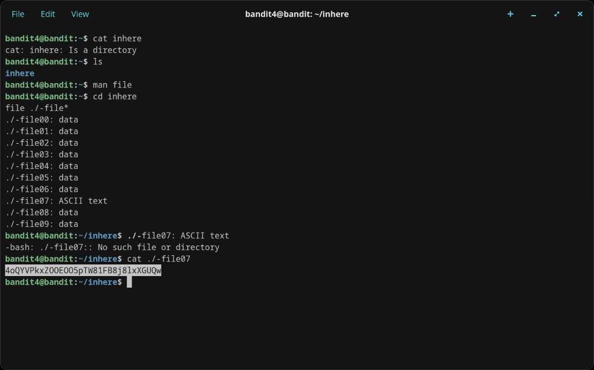

# Level 4 → 5

## Objective
The password is stored in the only human-readable file in the `inhere` directory, which contains files named `-file00` through `-file09`.

## Connection
```bash
ssh bandit4@bandit.labs.overthewire.org -p 2220
```
Password: `2WmrDFRmJIq3IPxneAaMGhap0pFhF3NJ`

## Solution

Navigate into `inhere` and use the `file` command to check the type of each file:

```bash
cd inhere
file ./-file*
```

The output shows all files are `data` (binary) except `./-file07`, which is `ASCII text` — the only human-readable one. Read it:

```bash
cat ./-file07
```

The password is printed.

## Password Found
`4oQYVPkxZOOEO5pTW81FB8j81xXGUQw`

## What I Learned
- The `file` command identifies file types without relying on extensions
- Using a glob (`*`) with `file` lets you check multiple files at once
- Files starting with `-` still need the `./` prefix trick when passed to `cat`
- Directly executing `./-file07` fails because the shell tries to run it as a program — `cat` is needed

## Screenshots



