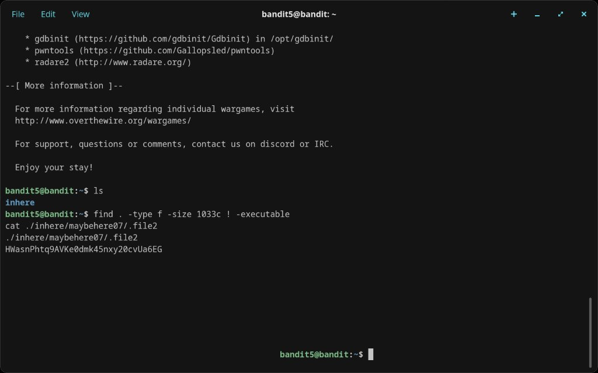

# Level 5 → 6

## Objective
The password is stored somewhere under the `inhere` directory and has the following properties: human-readable, 1033 bytes in size, not executable.

## Connection
```bash
ssh bandit5@bandit.labs.overthewire.org -p 2220
```
Password: `HWasnPhtq9AVKe0dmk45nxy20cvUa6EG`

## Solution

Use `find` with flags matching the file's known properties — regular file (`-type f`), exactly 1033 bytes (`-size 1033c`), and not executable (`! -executable`):

```bash
find . -type f -size 1033c ! -executable
```

This immediately returns `./inhere/maybehere07/.file2`. Read it:

```bash
cat ./inhere/maybehere07/.file2
```

## Password Found
`HWasnPhtq9AVKe0dmk45nxy20cvUa6EG`

## What I Learned
- `find` is extremely powerful for locating files by properties rather than name
- `-size 1033c` means 1033 bytes (c = bytes; k = kilobytes; M = megabytes)
- `! -executable` negates a condition — finds files that are NOT executable
- `-type f` restricts results to regular files, excluding directories and symlinks
- Combining multiple `find` flags narrows results precisely without manual searching

## Screenshots

