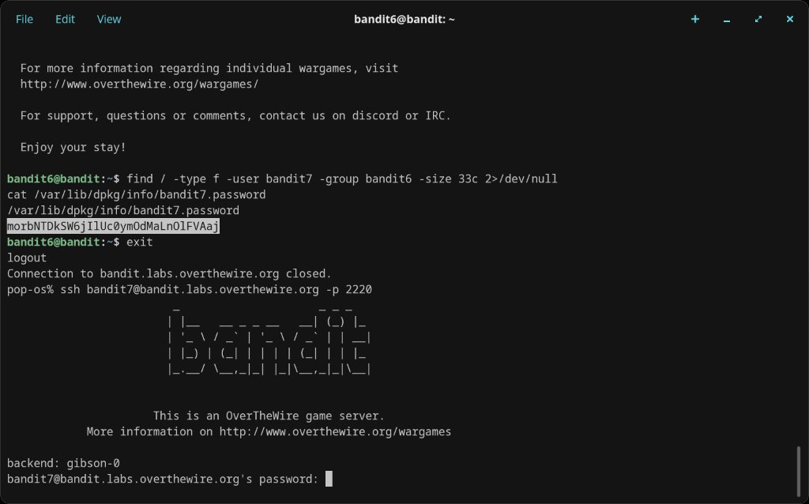

# Level 6 → 7

## Objective
The password is stored somewhere on the server and has the following properties: owned by user bandit7, owned by group bandit6, 33 bytes in size.

## Connection
```bash
ssh bandit6@bandit.labs.overthewire.org -p 2220
```
Password: `HWasnPhtq9AVKe0dmk45nxy20cvUa6EG`

## Solution

The file could be anywhere on the server, so search from root (`/`). To suppress the flood of "Permission denied" errors, redirect stderr to `/dev/null`:

```bash
find / -type f -user bandit7 -group bandit6 -size 33c 2>/dev/null
```

This returns `/var/lib/dpkg/info/bandit7.password`. Read it:

```bash
cat /var/lib/dpkg/info/bandit7.password
```

## Password Found
`morbNTDkSW6jIlUc0ymOdMaLnOlFVAaj`

## What I Learned
- `find /` searches the entire filesystem from root
- `-user` and `-group` flags filter by file ownership
- `2>/dev/null` redirects stderr (file descriptor 2) to `/dev/null`, silencing permission errors
- Without the redirect, thousands of "Permission denied" lines would bury the result
- System package metadata lives under `/var/lib/dpkg/info/`

## Screenshots

