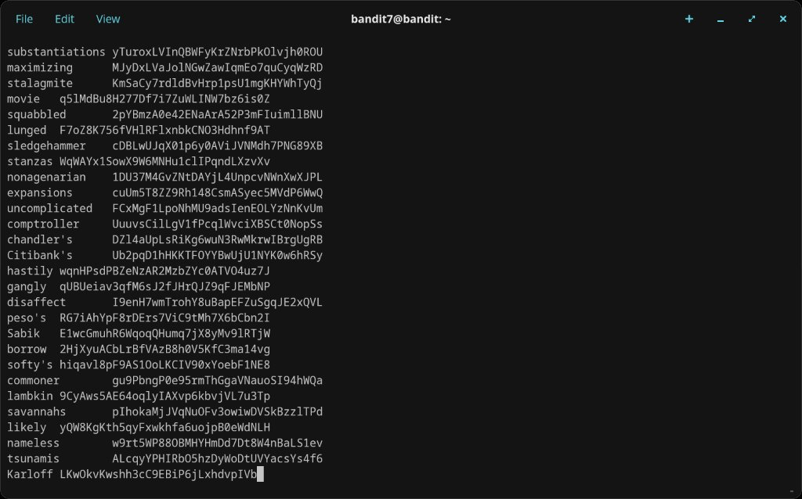
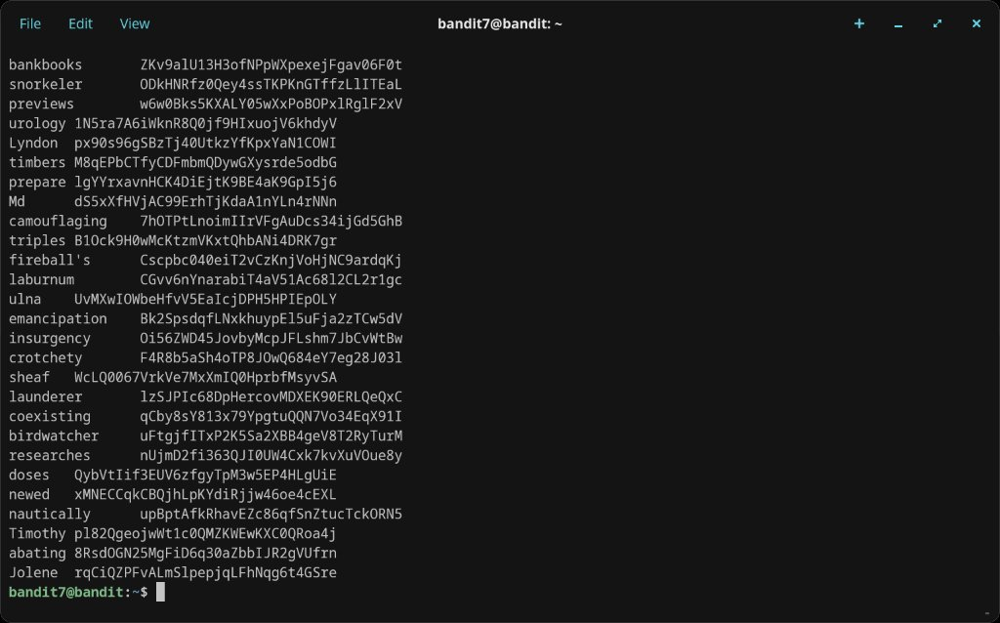
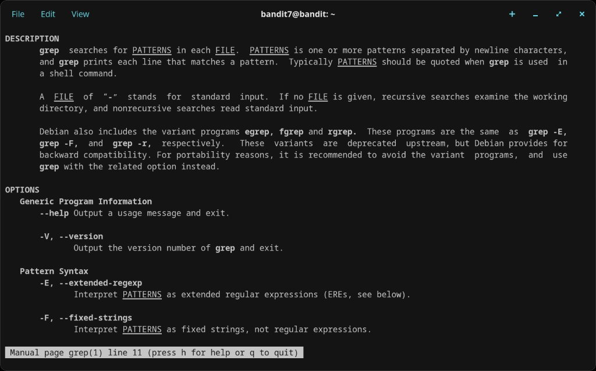
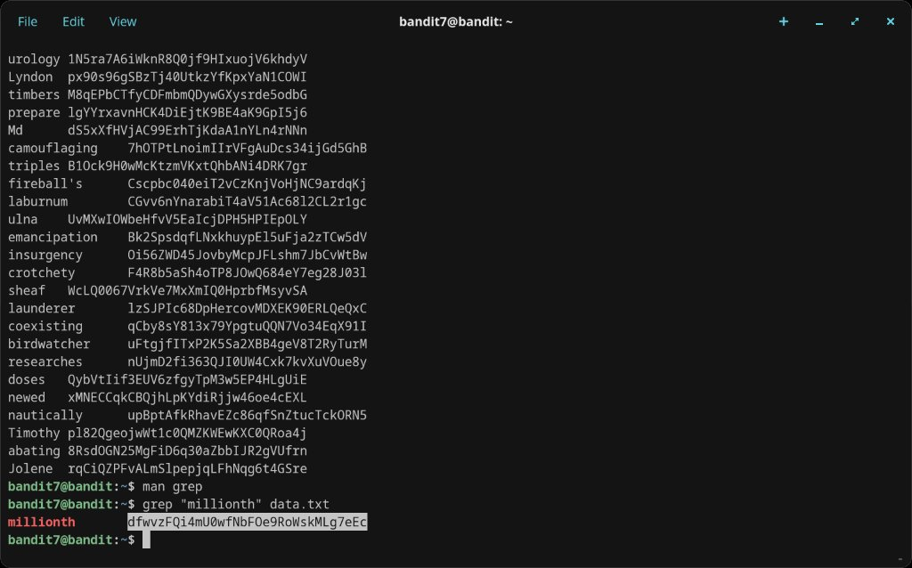
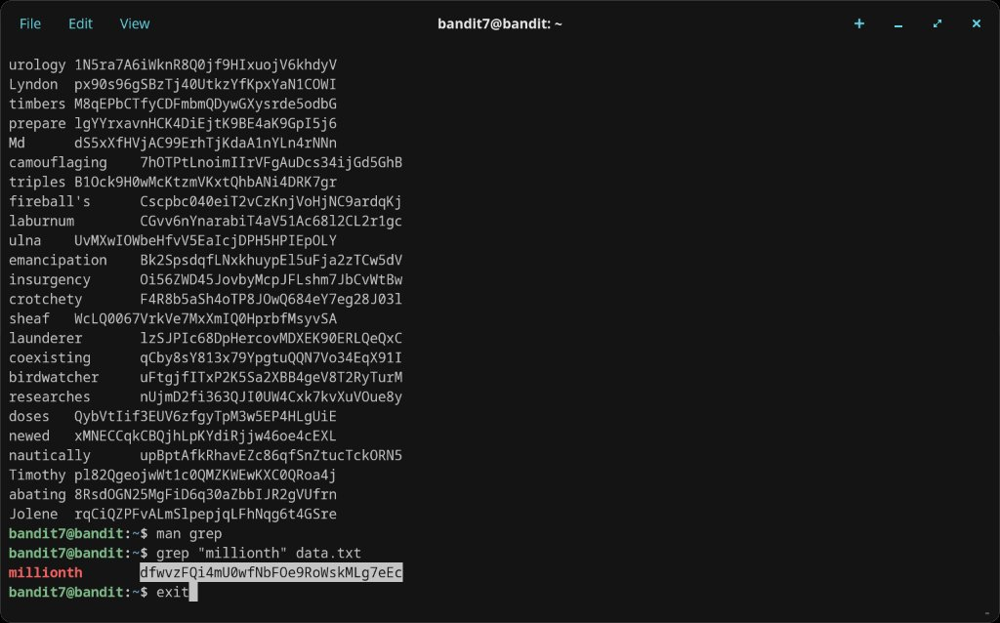

# Level 7 → 8

## Objective
The password is stored in the file `data.txt` next to the word "millionth".

## Connection
```bash
ssh bandit7@bandit.labs.overthewire.org -p 2220
```
Password: `morbNTDkSW6jIlUc0ymOdMaLnOlFVAaj`

## Solution

`data.txt` contains thousands of word-password pairs. Use `grep` to find the line containing "millionth":

```bash
grep "millionth" data.txt
```

The matching line is printed instantly:
```
millionth    dfwvzFQi4mU0wfNbFOe9RoWskMLg7eEc
```

## Password Found
`dfwvzFQi4mU0wfNbFOe9RoWskMLg7eEc`

## What I Learned
- `grep` searches for a pattern within a file and prints matching lines
- It handles large files efficiently — no need to scroll through thousands of lines manually
- `cat data.txt` would dump the whole file; `grep` finds exactly what you need
- Consulting `man grep` confirmed the basic syntax: `grep "pattern" file`

## Screenshots





