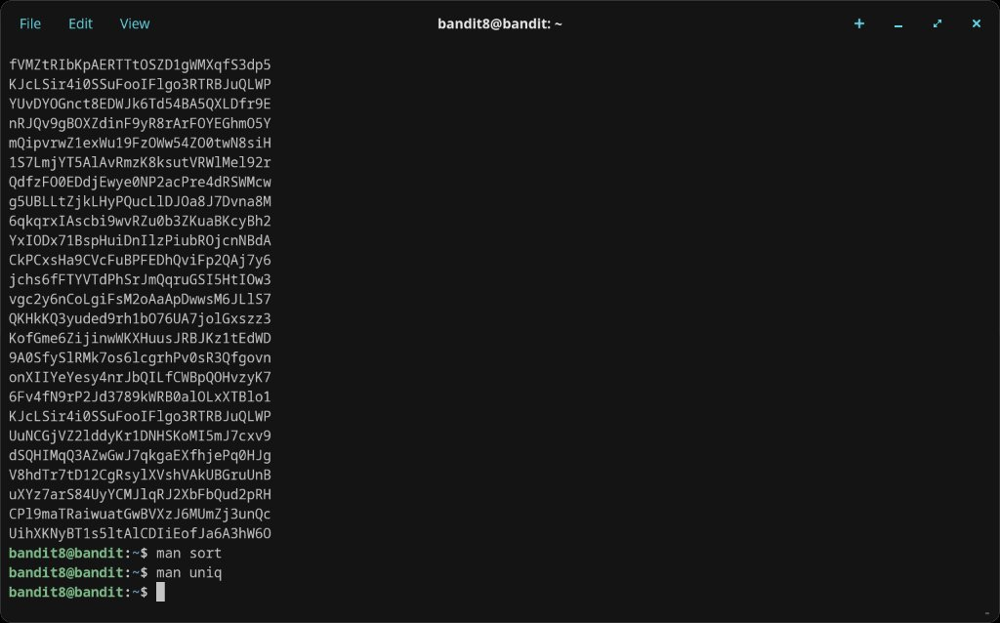

# Level 8 → 9

## Objective
The password is stored in `data.txt` and is the only line of text that occurs exactly once (all other lines are duplicates).

## Connection
```bash
ssh bandit8@bandit.labs.overthewire.org -p 2220
```
Password: `dfwvzFQi4mU0wfNbFOe9RoWskMLg7eEc`

## Solution

`uniq` removes or identifies duplicate lines, but only works on adjacent duplicates — so the file must be sorted first. Pipe `sort` into `uniq -u` (unique lines only):

```bash
sort data.txt | uniq -u
```

A single password is printed.

## What I Learned
- `uniq` only detects adjacent duplicates, so `sort` must come first
- `uniq -u` prints only lines that appear exactly once
- `uniq -d` would print only duplicate lines (the opposite)
- Piping (`|`) chains commands: the output of `sort` becomes the input of `uniq`
- `man sort` and `man uniq` were both consulted to confirm the right flags

## Screenshots

