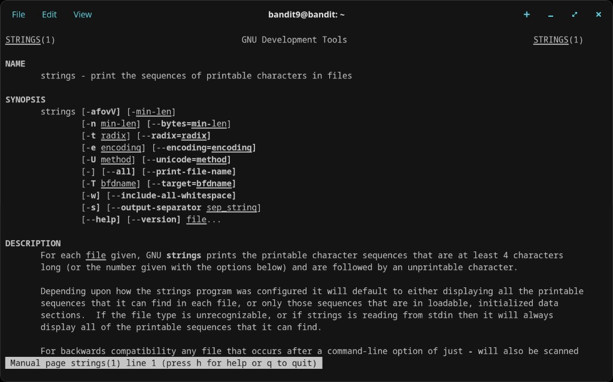
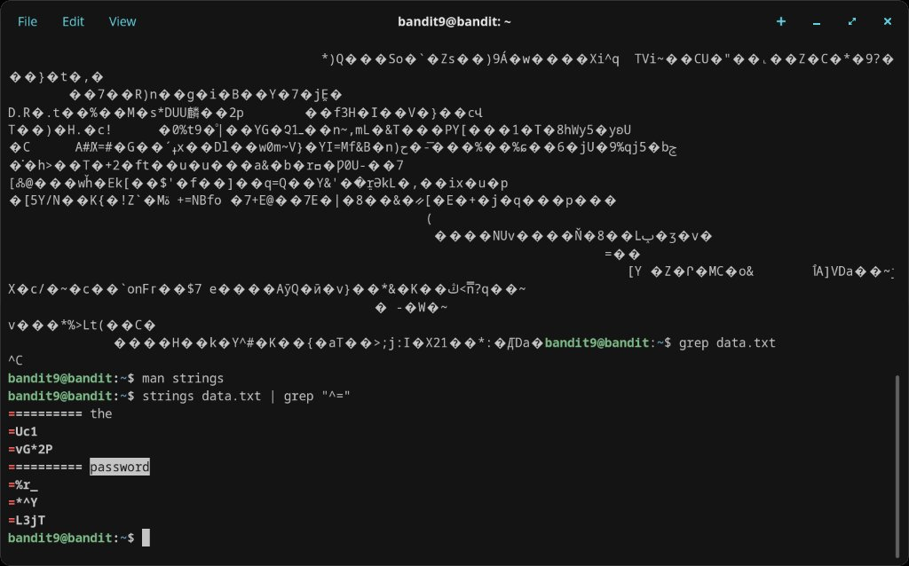
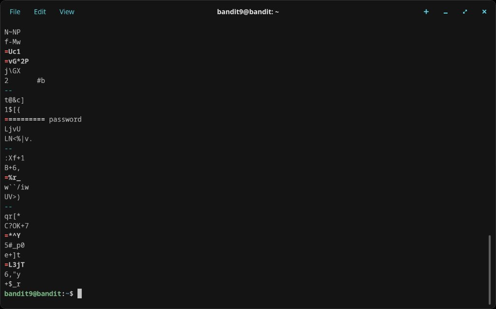
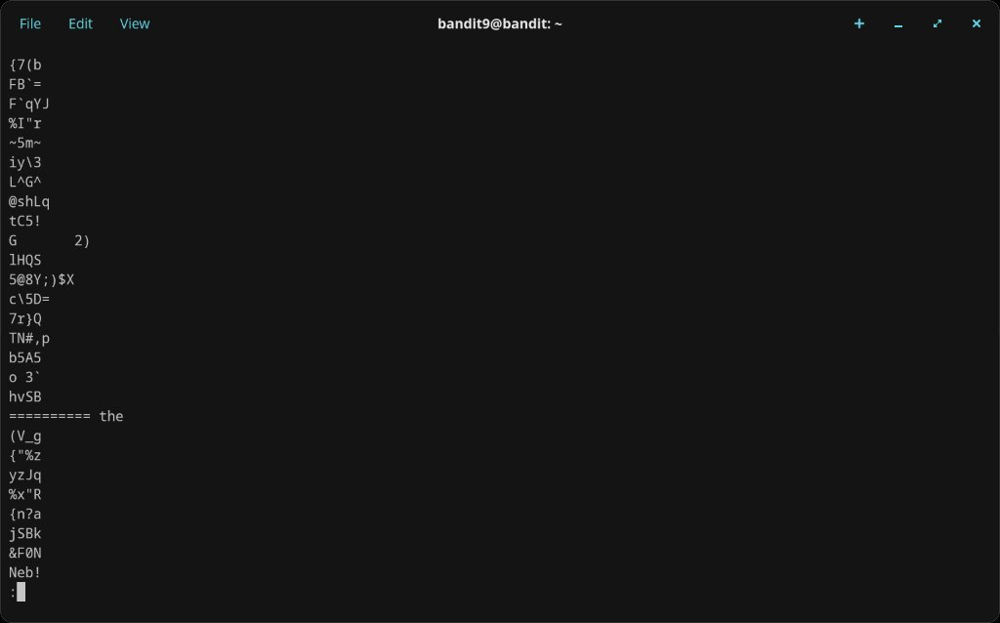
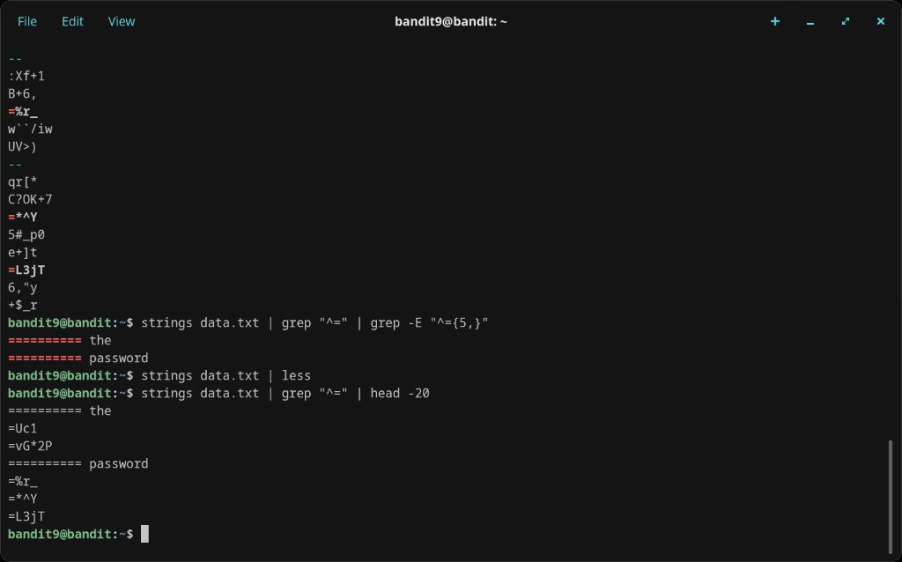
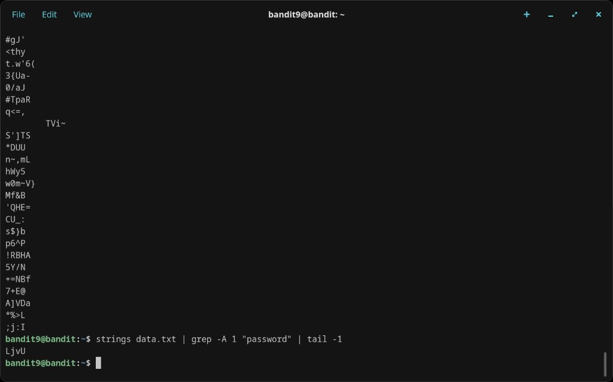
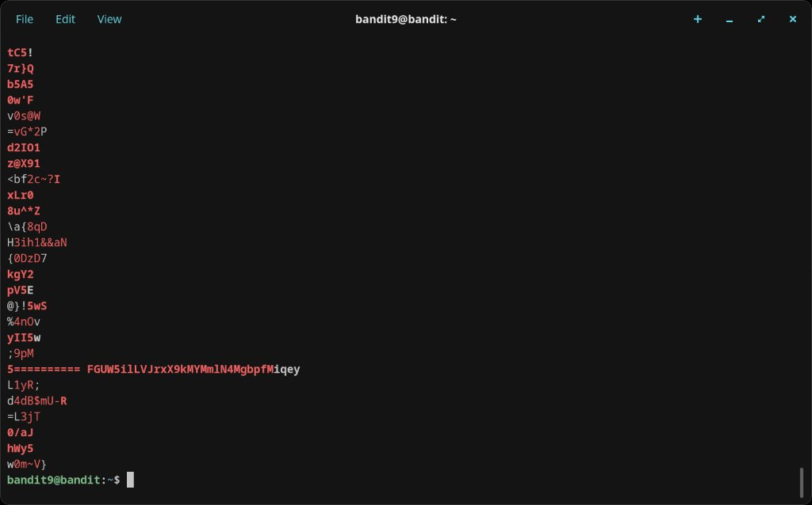
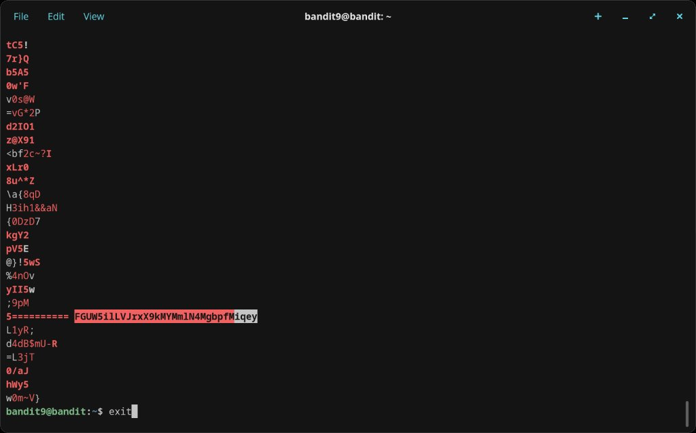

# Level 9 → 10

## Objective
The password is stored in `data.txt` in one of the few human-readable strings, preceded by several `=` characters.

## Connection
```bash
ssh bandit9@bandit.labs.overthewire.org -p 2220
```
Password: `4CKMh1JI91bUIZZPXDqGanal4xvAg0JM`

## Solution

`data.txt` is a binary file, so `cat` produces garbled output. The `strings` command extracts human-readable sequences from binary files. Piping into `grep` filters for lines starting with `=`:

```bash
strings data.txt | grep "^="
```

This returned several matches including short fragments like `=Uc1`, `=vG*2P`, `=%r_`, `=*^Y`, and `=L3jT`, plus the key lines:
```
========== the
========== password
```

To isolate the actual password, I refined the approach — grepping for the line after "password" and scrolling through the full `strings` output to find:
```
========== FGUW5ilLVJrxX9kMYMm1N4MgbpfMiqey
```

## Password Found
`FGUW5ilLVJrxX9kMYMm1N4MgbpfMiqey`

## What I Learned
- `strings` extracts printable character sequences (default: 4+ characters) from binary files
- Piping `strings` into `grep` is a standard technique for finding readable content in binary data
- `grep -A 1 "pattern"` prints the matching line plus 1 line after it — useful for context
- Iterative refinement of grep patterns (`"^="`, `"^={5,}"`, `-A 1 "password"`) narrows down results
- `man strings` confirmed the tool's purpose and options

## Screenshots








