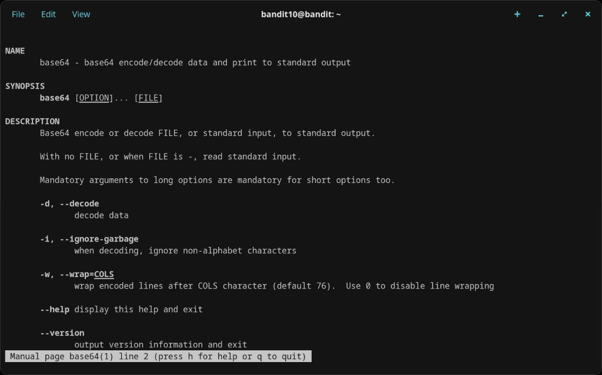
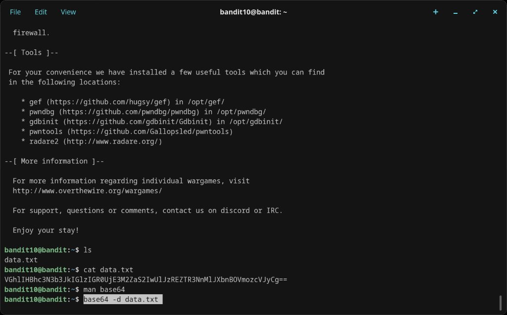
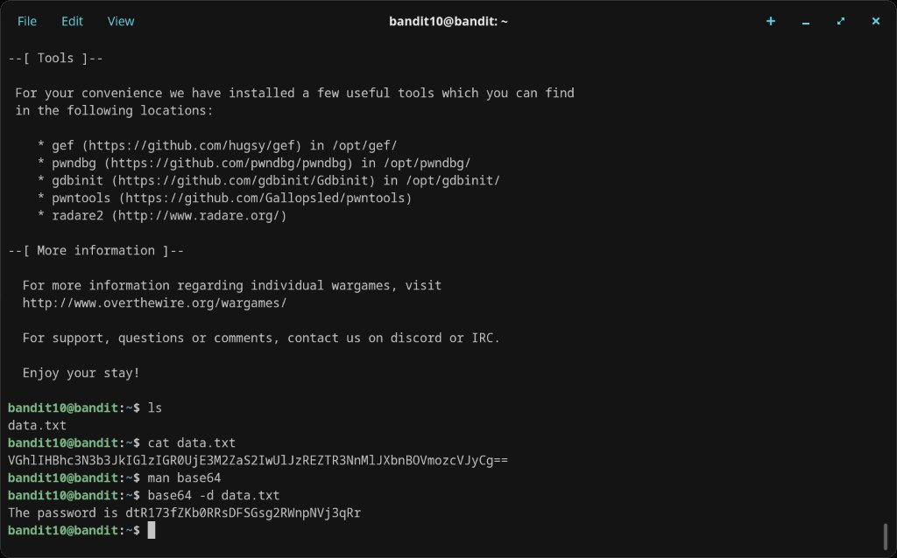

# Level 10 → 11

## Objective
The password is stored in `data.txt`, which contains base64 encoded data.

## Connection
```bash
ssh bandit10@bandit.labs.overthewire.org -p 2220
```
Password: `FGUW5ilLVJrxX9kMYMm1N4MgbpfMiqey`

## Solution

`cat data.txt` reveals a base64-encoded string. The `base64` command with the `-d` flag decodes it:

```bash
base64 -d data.txt
```

Output:
```
The password is dtR173fZKb0RRsDFSGsg2RWnpNVj3qRr
```

## Password Found
`dtR173fZKb0RRsDFSGsg2RWnpNVj3qRr`

## What I Learned
- Base64 encoding converts binary data into ASCII text using a 64-character alphabet (A-Z, a-z, 0-9, +, /)
- The `=` or `==` padding at the end of a string is a telltale sign of base64 encoding
- `base64 -d` decodes; `base64` without flags encodes
- `man base64` confirmed the `-d` / `--decode` flag and other options like `-w` for wrap width

## Screenshots



