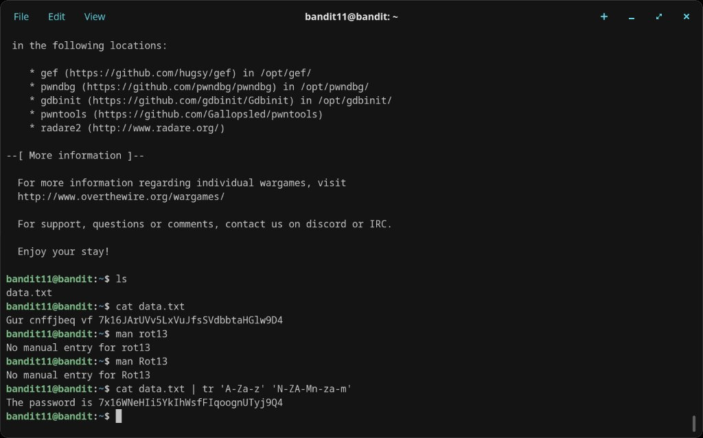

# Level 11 → 12

## Objective
The password is stored in `data.txt`, where all lowercase (a-z) and uppercase (A-Z) letters have been rotated by 13 positions (ROT13).

## Connection
```bash
ssh bandit11@bandit.labs.overthewire.org -p 2220
```
Password: `dtR173fZKb0RRsDFSGsg2RWnpNVj3qRr`

## Solution

`cat data.txt` reveals the ROT13-encoded text:
```
Gur cnffjbeq vf 7k16JArUVv5LxVuJfsSVdbbtaHGlw9D4
```

ROT13 shifts each letter by 13 positions in the alphabet. Since the alphabet has 26 letters, applying ROT13 twice returns the original text. The `tr` command handles the character substitution:

```bash
cat data.txt | tr 'A-Za-z' 'N-ZA-Mn-za-m'
```

Output:
```
The password is 7x16WNeHIi5YkIhWsfFIqoognUTyj9Q4
```

## Password Found
`7x16WNeHIi5YkIhWsfFIqoognUTyj9Q4`

## What I Learned
- ROT13 is a simple substitution cipher — each letter is replaced by the letter 13 positions ahead
- `tr 'A-Za-z' 'N-ZA-Mn-za-m'` maps A→N, B→O, ..., M→Z, N→A, etc. for both cases
- `tr` (translate) replaces characters from one set with corresponding characters in another
- There is no dedicated `rot13` command — `tr` is the standard Unix approach
- Numbers and symbols are unaffected by ROT13; only alphabetic characters shift

## Screenshots

