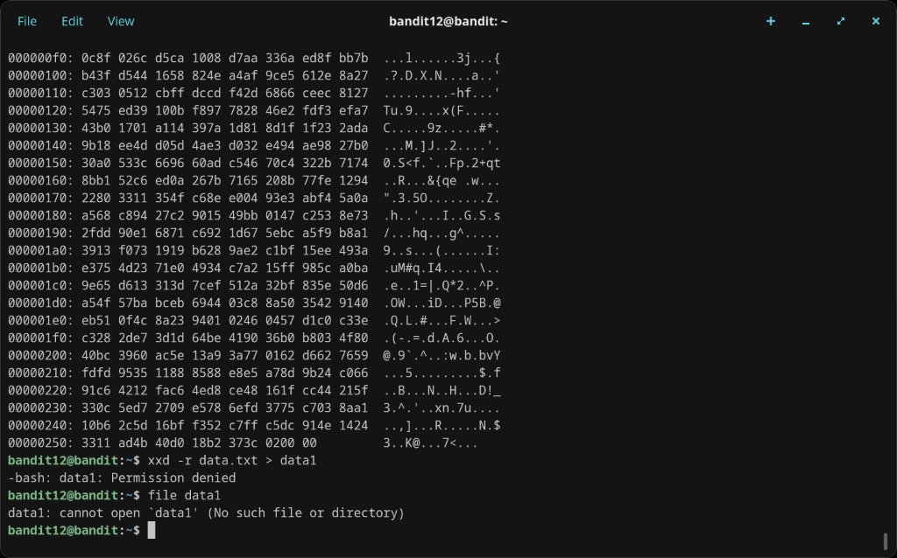
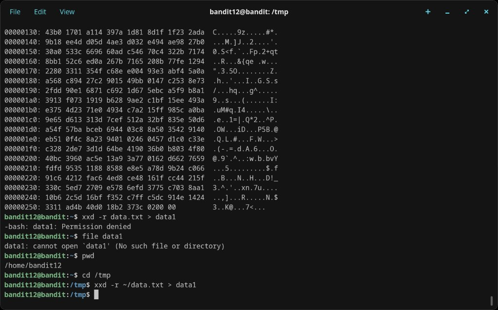
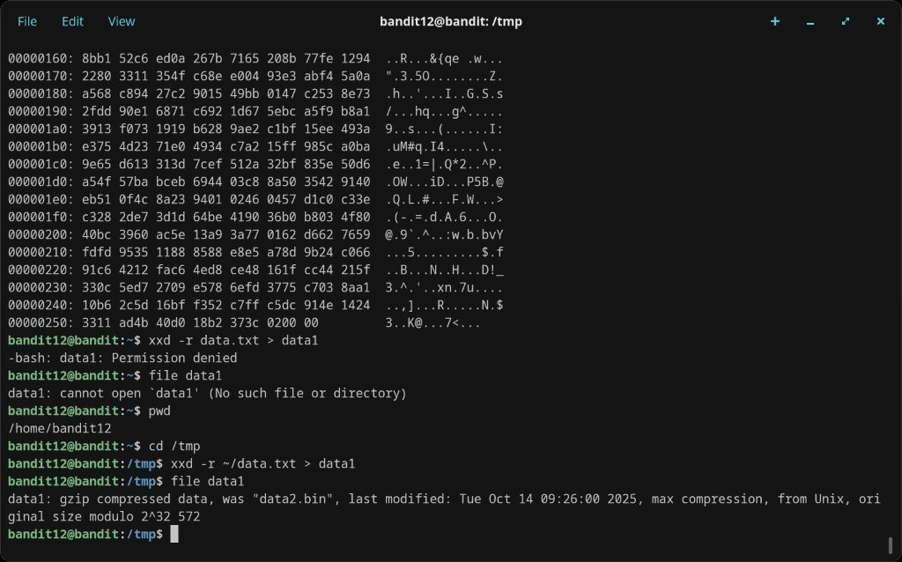

# Level 12 → 13

## Objective
The password is stored in `data.txt`, which is a hexdump of a file that has been repeatedly compressed. Create a directory under `/tmp` to work in.

## Connection
```bash
ssh bandit12@bandit.labs.overthewire.org -p 2220
```
Password: `7x16WNeHIi5YkIhWsfFIqoognUTyj9Q4`

## Solution (In Progress)

The file is a hexdump, so the first step is reversing it back to binary with `xxd -r`. Writing to the home directory is not permitted, so a working directory under `/tmp` is needed:

```bash
cd /tmp
xxd -r ~/data.txt > data1
file data1
```

`file data1` reveals the result is gzip compressed data (originally named "data2.bin"). From here, the process involves repeated cycles of:
1. Check the file type with `file`
2. Rename with the appropriate extension (.gz, .bz2, .tar)
3. Decompress with the matching tool (`gzip -d`, `bzip2 -d`, `tar xf`)
4. Repeat until a plain text file containing the password is reached

## What I Learned
- `xxd -r` reverses a hexdump back into binary
- Home directories on shared systems are often read-only; `/tmp` is the standard writable workspace
- `file` identifies file types by inspecting magic bytes, regardless of the file extension
- Nested compression is a common CTF technique — patience and methodical checking with `file` is key
- Tools used: `xxd`, `gzip`, `bzip2`, `tar`, `file`

## Screenshots



