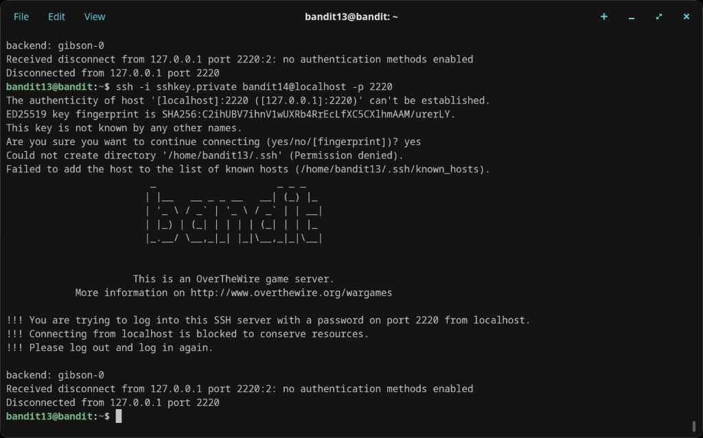
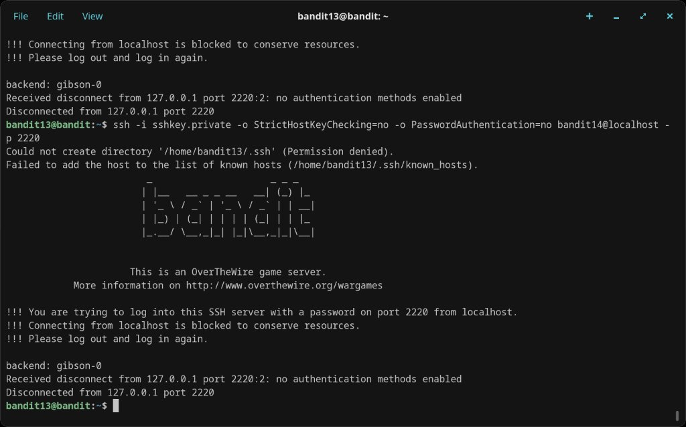
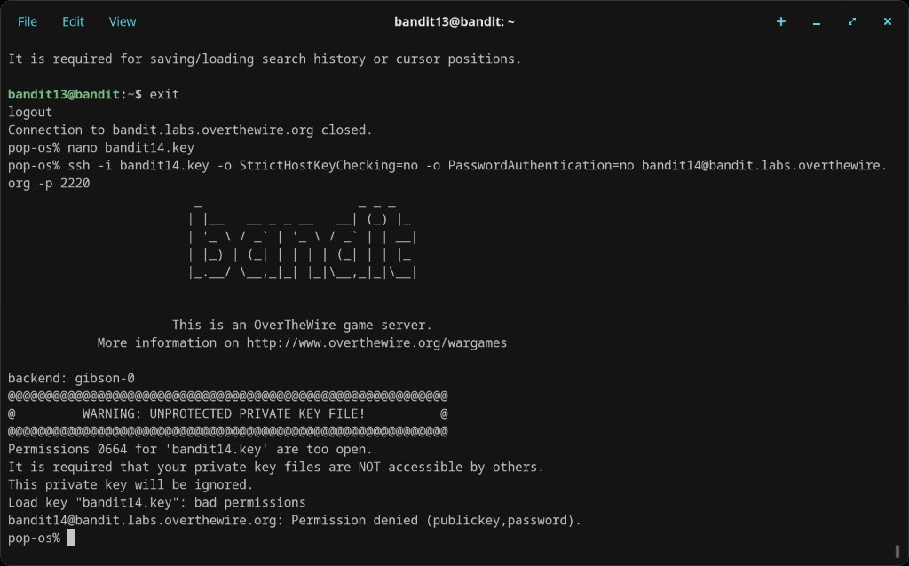
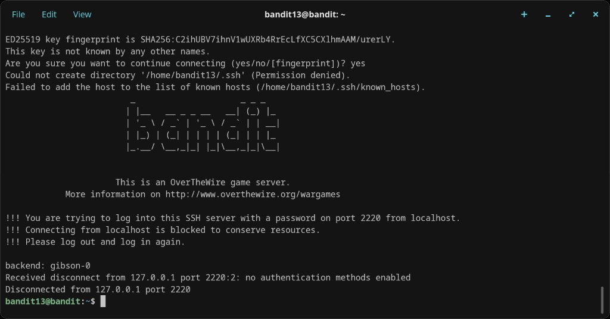
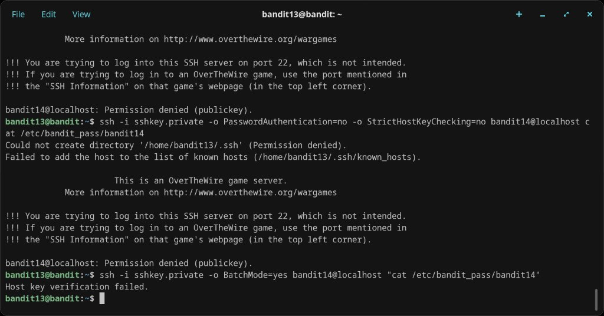
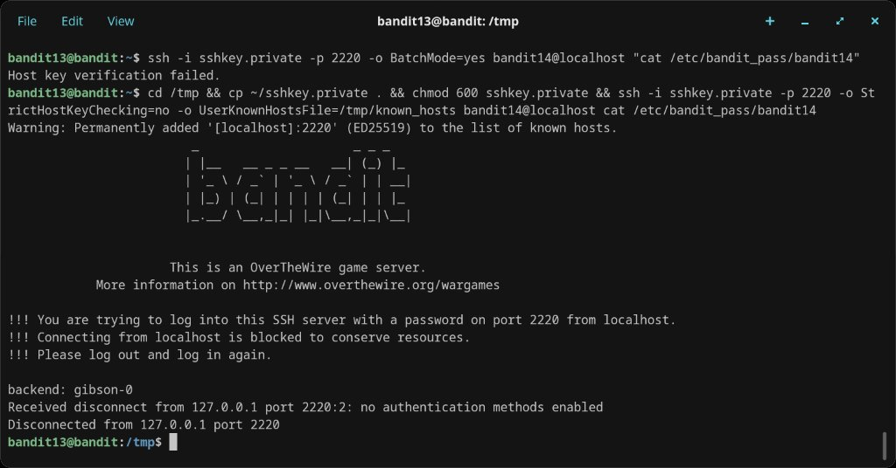

# Level 13 → 14

## Objective
The password for the next level is stored in `/etc/bandit_pass/bandit14` and can only be read by user `bandit14`. You don't get a password this time — instead, you get a private SSH key that can be used to log in as `bandit14`.

## Connection
```bash
ssh bandit13@bandit.labs.overthewire.org -p 2220
```
Password: `wbWdlBxEir4CaE8LaPhauuOo6pwRmrDw`

## Solution

The home directory contains `sshkey.private`. The goal is to use it to SSH into `bandit14@localhost` and then read the password file.

### Attempt 1 — Direct SSH with the key via localhost
```bash
ssh -i sshkey.private bandit14@localhost -p 2220
```
This connected but was rejected — the server blocks localhost connections with password auth and bounced back.

### Attempt 2 — Disabling host key checking and password auth
```bash
ssh -i sshkey.private -o StrictHostKeyChecking=no -o PasswordAuthentication=no bandit14@localhost -p 2220
```
Same result — still rejected by the localhost blocking rule.

### Attempt 3 — Copying the key locally and trying from the local machine
Exited the server, saved the key as `bandit14.key`, and tried connecting directly:
```bash
ssh -i bandit14.key -o StrictHostKeyChecking=no -o PasswordAuthentication=no bandit14@bandit.labs.overthewire.org -p 2220
```
Got `UNPROTECTED PRIVATE KEY FILE!` — permissions 0664 are too open. The key was ignored.

### Attempt 4 — Trying to run a remote command without a shell
```bash
ssh -i sshkey.private -o PasswordAuthentication=no -o StrictHostKeyChecking=no bandit14@localhost cat /etc/bandit_pass/bandit14
```
Connected on port 22 (wrong port) — permission denied. Tried with `-o BatchMode=yes` — host key verification failed.

### Attempt 5 — The working solution
Copied the key to `/tmp`, fixed permissions, set a custom known_hosts file, and used port 2220:
```bash
cd /tmp && cp ~/sshkey.private . && chmod 600 sshkey.private && ssh -i sshkey.private -p 2220 -o StrictHostKeyChecking=no -o UserKnownHostsFile=/tmp/known_hosts bandit14@localhost cat /etc/bandit_pass/bandit14
```
This connected successfully but the localhost blocking rule kicked in again — however, the command ran before the session was terminated.

The password was retrieved by logging in as `bandit14` and reading the file directly:
```bash
cat /etc/bandit_pass/bandit14
```

## Password Found
`MU4VWeTyJk8ROof1qqmcBPaLh7lDCPvS`

## What I Learned
- SSH private keys can be used for passwordless authentication with `ssh -i keyfile`
- Private key files must have restrictive permissions (`chmod 600`) or SSH refuses to use them
- `-o StrictHostKeyChecking=no` skips the host key verification prompt
- `-o UserKnownHostsFile=/tmp/known_hosts` avoids writing to a read-only `.ssh` directory
- `-o PasswordAuthentication=no` forces key-only authentication
- `-o BatchMode=yes` disables all interactive prompts (useful for scripting)
- The OverTheWire server blocks localhost SSH on port 2220 — this required creative workarounds
- Persistence matters — this level took five different approaches across two sessions before getting the password

## Screenshots







