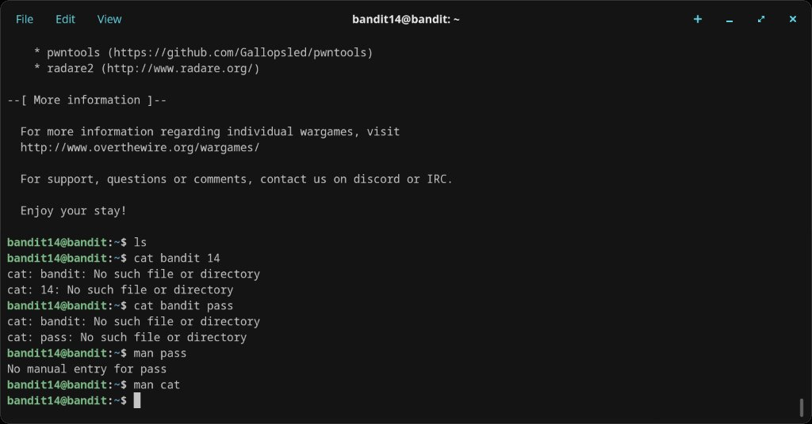
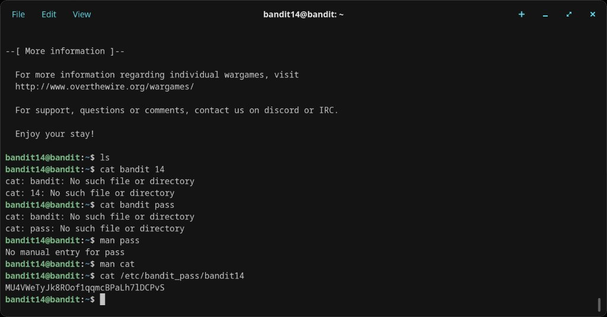
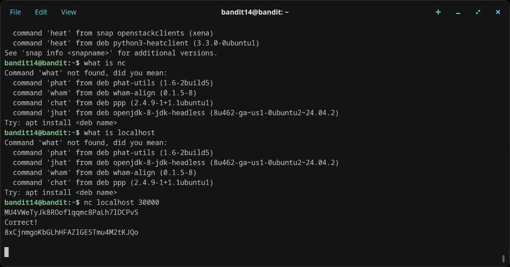

# Level 14 → 15

## Objective
The password for the next level can be retrieved by submitting the password of the current level to port 30000 on localhost.

## Connection
```bash
ssh bandit14@bandit.labs.overthewire.org -p 2220
```
Password: `MU4VWeTyJk8ROof1qqmcBPaLh7lDCPvS`

## Solution

First, the current level's password needs to be confirmed. After some initial fumbling with `cat bandit 14` and `cat bandit pass` (which tried to cat multiple files), the correct path was found:

```bash
cat /etc/bandit_pass/bandit14
```
Output: `MU4VWeTyJk8ROof1qqmcBPaLh7lDCPvS`

Then, submit that password to port 30000 on localhost using `nc` (netcat):

```bash
nc localhost 30000
MU4VWeTyJk8ROof1qqmcBPaLh7lDCPvS
```

The server responds with `Correct!` and the next password.

## Password Found
`8xCjnmgoKbGLhHFAZlGE5Tmu4M2tKJQo`

## What I Learned
- `nc` (netcat) creates raw TCP connections to a host and port — useful for talking to network services
- Bandit passwords are stored in `/etc/bandit_pass/banditN`, readable only by the corresponding user
- `cat bandit 14` treats `bandit` and `14` as two separate file arguments — quoting or the full path is needed
- Port 30000 was running a simple challenge-response service: send the right password, get the next one
- This is an introduction to network service interaction — a core skill for later levels and CTFs

## Screenshots



