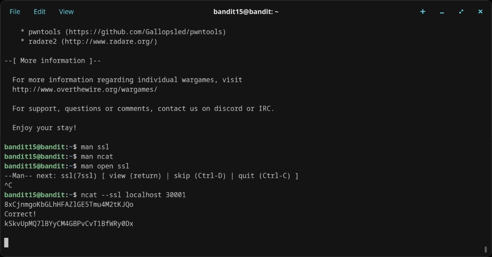

# Level 15 → 16

## Objective
The password for the next level can be retrieved by submitting the password of the current level to port 30001 on localhost using SSL encryption.

## Connection
```bash
ssh bandit15@bandit.labs.overthewire.org -p 2220
```
Password: `8xCjnmgoKbGLhHFAZlGE5Tmu4M2tKJQo`

## Solution

This is similar to the previous level, but the service on port 30001 requires an SSL/TLS connection. After checking `man ssl`, `man ncat`, and `man open ssl`, the solution uses `ncat` with the `--ssl` flag:

```bash
ncat --ssl localhost 30001
kSkvUpMQ71BWYyCM4GBPvCvT1BfWRy0Dx
```

After submitting the current password, the server responds with `Correct!` and the next password.

## Password Found
`kSkvUpMQ71BWYyCM4GBPvCvT1BfWRy0Dx`

## What I Learned
- `ncat --ssl` establishes an SSL/TLS encrypted connection — the secure equivalent of plain `nc`
- SSL/TLS wraps TCP connections in encryption; the server on port 30001 won't accept unencrypted connections
- `openssl s_client -connect localhost:30001` is an alternative approach using the OpenSSL toolkit
- The difference between level 14→15 (plain TCP on port 30000) and this level (SSL on port 30001) illustrates why encrypted connections matter

## Screenshots

