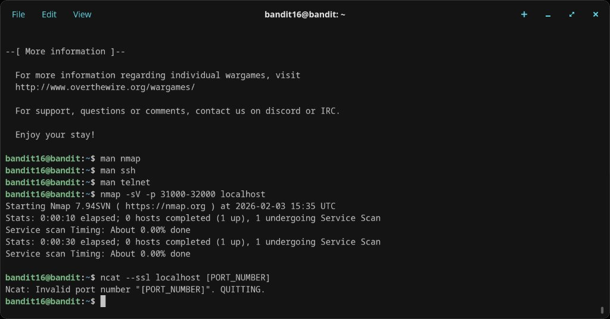
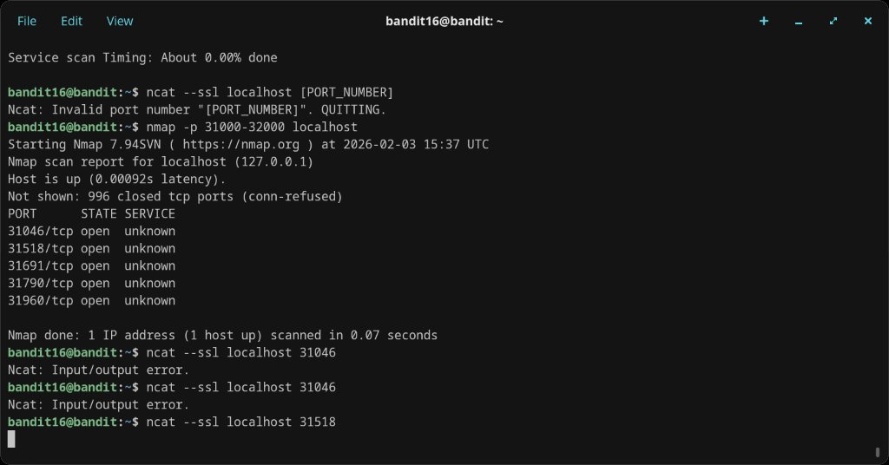
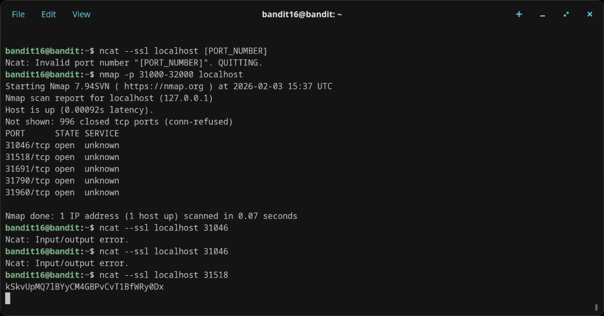
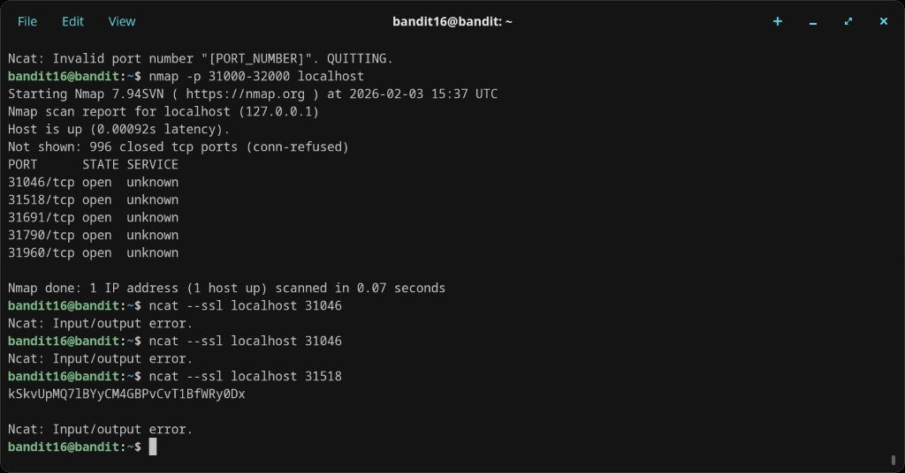
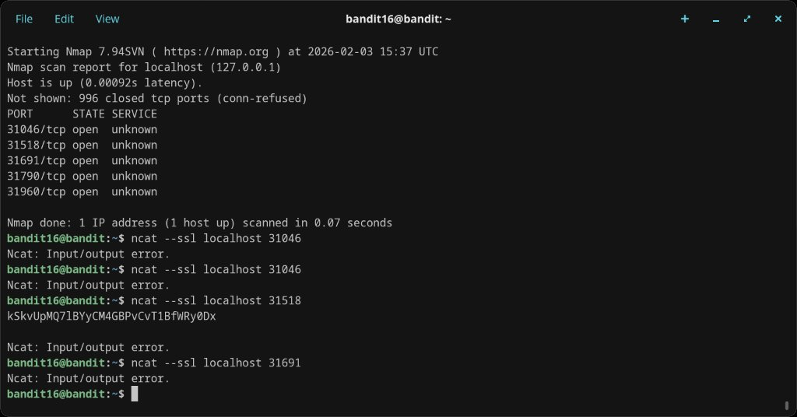
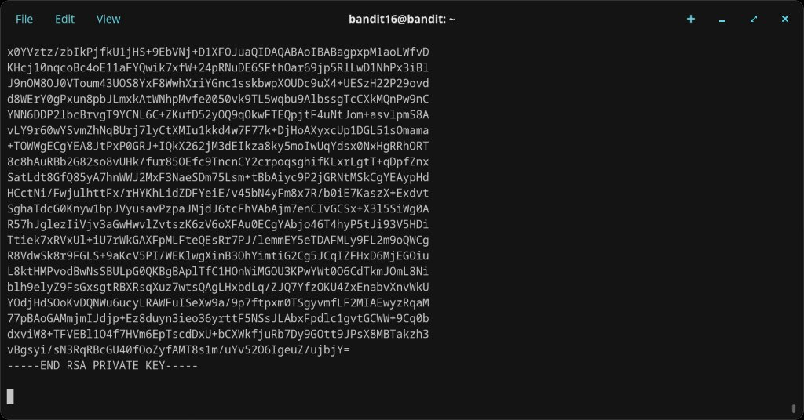
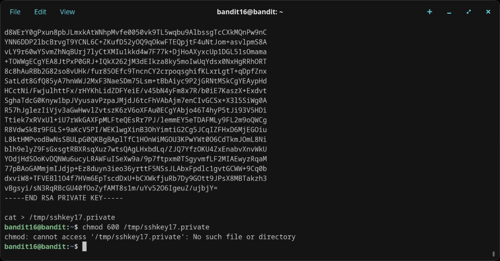
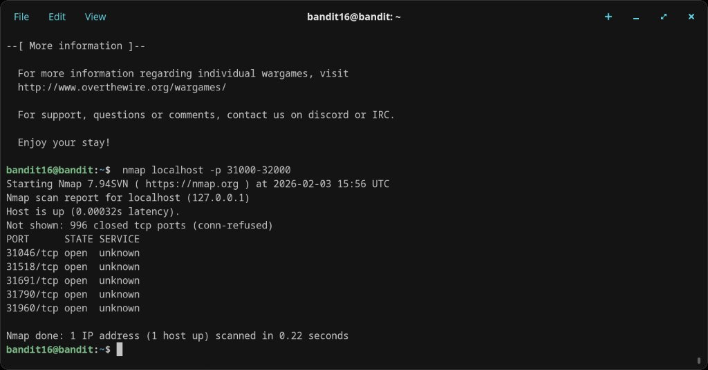

# Level 16 → 17

## Objective
The credentials for the next level can be retrieved by submitting the password of the current level to a port on localhost in the range 31000 to 32000. First find out which of these ports have a server listening on them, then find out which of those speak SSL and which don't. Only one server will give the next credentials — the others will simply echo back whatever you send.

## Connection
```bash
ssh bandit16@bandit.labs.overthewire.org -p 2220
```
Password: `kSkvUpMQ71BWYyCM4GBPvCvT1BfWRy0Dx`

## Solution

### Step 1 — Port scanning with nmap
First, scan the port range to find open ports:

```bash
nmap -p 31000-32000 localhost
```

The initial attempt with `-sV` (service version detection) was slow, so a basic port scan was used instead. Five open ports were found: 31046, 31518, 31691, 31790, and 31960.

### Step 2 — Testing each port with ncat --ssl
Tried connecting to each port via SSL to find the one that returns credentials rather than echoing input:

- **Port 31046** — `ncat --ssl localhost 31046` → Input/output error (twice)
- **Port 31518** — `ncat --ssl localhost 31518` → Echoed back the password, then I/O error (echo server, not the right one)
- **Port 31691** — `ncat --ssl localhost 31691` → Input/output error
- **Port 31790** — `ncat --ssl localhost 31790` → Returned an RSA private key

### Step 3 — Saving the SSH key
Port 31790 returned a full RSA private key. The key needed to be saved to a file and given proper permissions:

```bash
cat > /tmp/sshkey17.private
# (paste key content, Ctrl+D)
chmod 600 /tmp/sshkey17.private
```

The initial `chmod` attempt failed because the `cat >` redirect hadn't actually written the file yet. The key was eventually saved and used to log in as bandit17.

## Password Found
An RSA private key for bandit17 (not a text password this time).

## What I Learned
- `nmap -p RANGE localhost` scans a specific port range on the local machine
- `-sV` adds service version detection but is significantly slower than a basic port scan
- Not all open ports speak the same protocol — some are plain TCP, some require SSL
- Echo servers simply reflect input back; the correct server returns different data (in this case, an SSH key)
- Some levels give SSH keys instead of passwords — both are valid authentication credentials
- Methodically testing each port is sometimes the only approach when services are labelled "unknown"
- The `cat >` redirect pattern writes stdin to a file (end with Ctrl+D)

## Screenshots

![ncat --ssl [PORT_NUMBER] placeholder error, nmap -p basic scan — 5 open ports found](screenshots/level-16-17/step-02.png)







