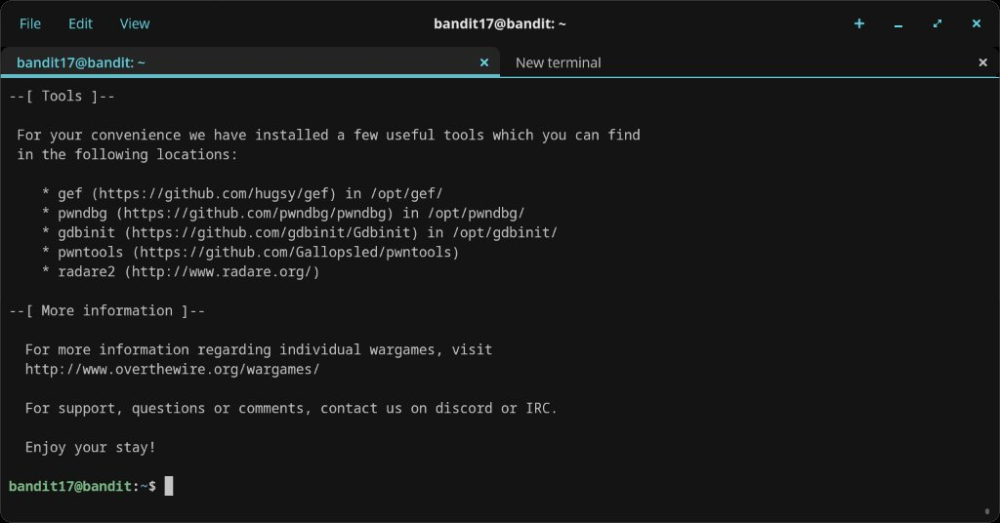
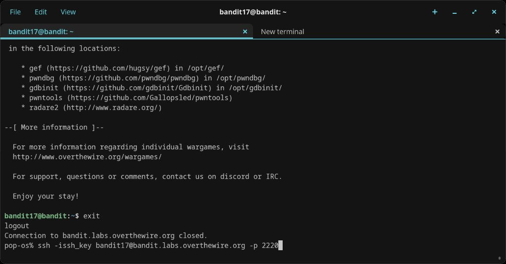
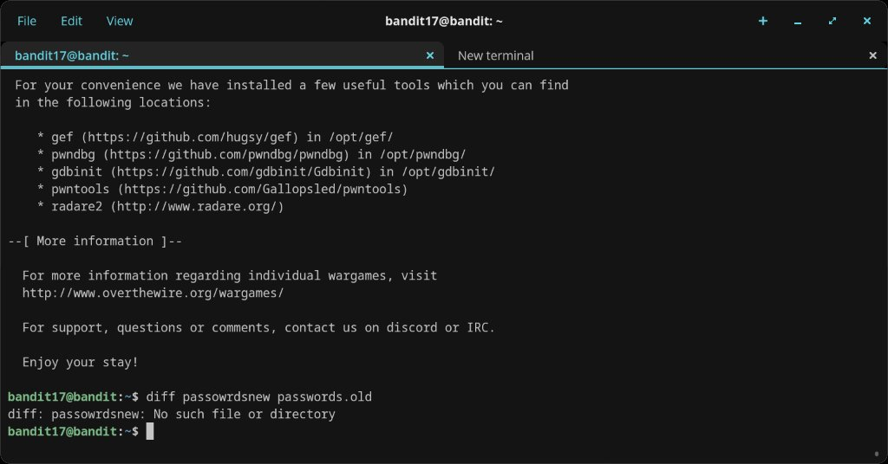
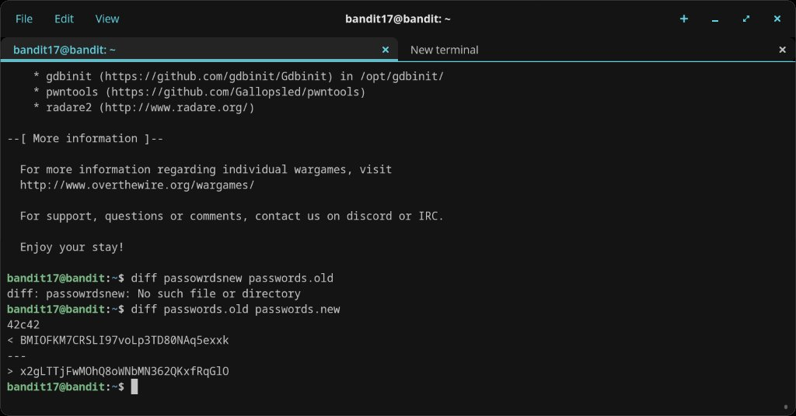

# Level 17 → 18

## Objective
There are two files in the home directory: `passwords.old` and `passwords.new`. The password for the next level is in `passwords.new` and is the only line that has been changed between the two files.

## Connection
```bash
ssh bandit17@bandit.labs.overthewire.org -p 2220 -issh_key
```
Using the RSA private key obtained from level 16 → 17.

## Solution

### Step 1 — Log in and orient
Logged in using the SSH key from the previous level. The MOTD banner shows the available tools and server information.

### Step 2 — First diff attempt (typo)
Tried to compare the files but mistyped the filename:

```bash
diff passowrdsnew passwords.old
```

Got `diff: passowrdsnew: No such file or directory` — a simple typo (`passowrdsnew` instead of `passwords.new`).

### Step 3 — Correct diff command
Ran the command again with the right filenames:

```bash
diff passwords.old passwords.new
```

The output showed one changed line at line 42 (`42c42`). The `<` line is the old password and the `>` line is the new one — the password for bandit18.

## Password Found
`x2gLTTjFwMOhQ8oWNbMN362QKxfRqGlO`

## What I Learned
- `diff` compares two files line by line and shows only the differences
- The `<` symbol represents lines from the first file, `>` represents lines from the second file
- The notation `42c42` means line 42 in the first file was changed to line 42 in the second file
- Typos happen — always double-check filenames before assuming a command is broken

## Screenshots




