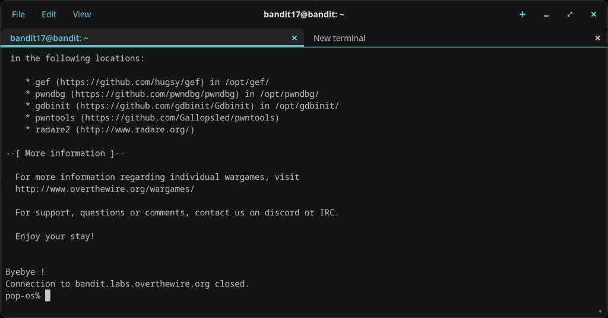
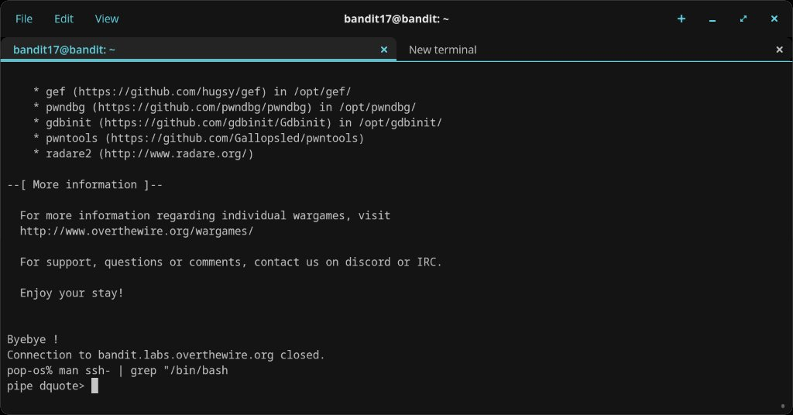
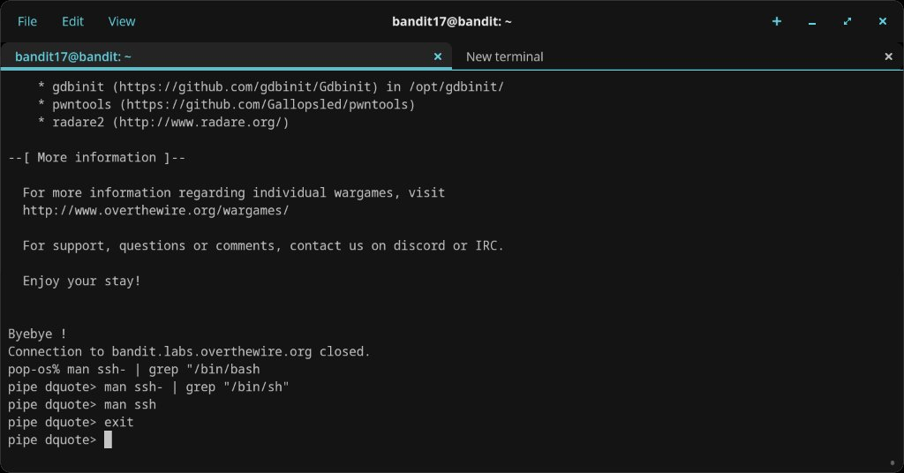
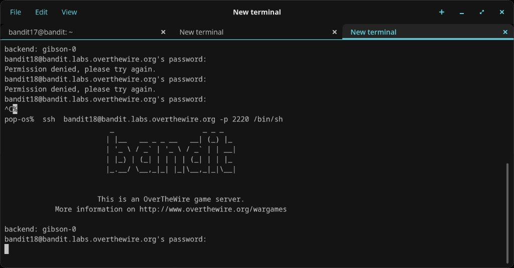
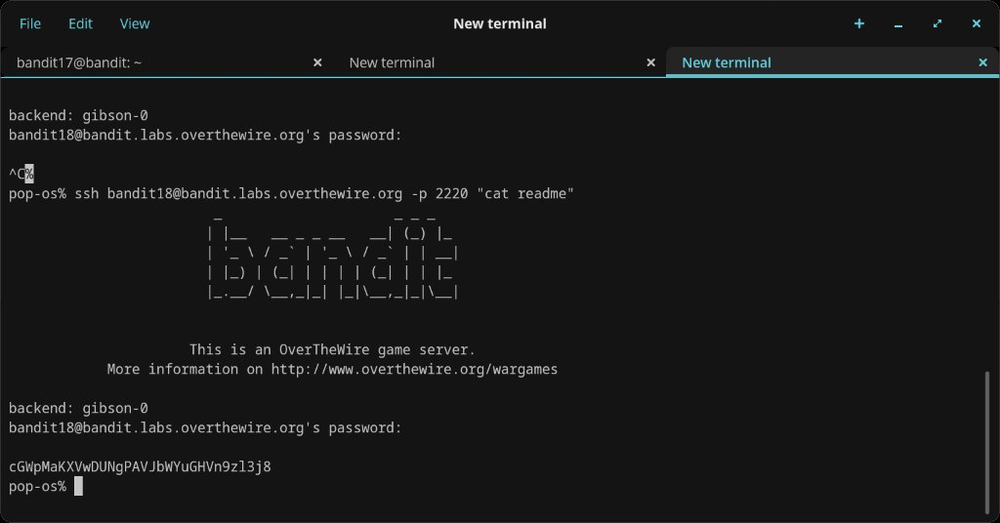

# Level 18 → 19

## Objective
The password for the next level is stored in a file called `readme` in the home directory. However, the `.bashrc` has been modified to log you out immediately when you log in with SSH.

## Connection
```bash
ssh bandit18@bandit.labs.overthewire.org -p 2220
```
Password: `x2gLTTjFwMOhQ8oWNbMN362QKxfRqGlO`

## Solution

### Step 1 — Observe the problem
Attempted a normal SSH login as bandit18. The connection succeeded but immediately printed `Byebye !` and closed — the `.bashrc` is forcing a logout on interactive login.

### Step 2 — Research a bypass
Tried reading the SSH man page to find options for bypassing the login shell:

```bash
man ssh- | grep "/bin/bash"
man ssh- | grep "/bin/sh"
```

Got stuck in a `pipe dquote>` prompt due to unclosed quotes — had to work through the broken pipe before moving on.

### Step 3 — Try /bin/sh bypass
In a new terminal tab, first attempted a standard password login (got permission denied — wrong password on initial tries). Then tried passing `/bin/sh` as a command to SSH to bypass `.bashrc`:

```bash
ssh bandit18@bandit.labs.overthewire.org -p 2220 /bin/sh
```

This connected successfully, bypassing the `.bashrc` logout.

### Step 4 — Execute cat remotely
Used SSH's remote command execution to read the file directly:

```bash
ssh bandit18@bandit.labs.overthewire.org -p 2220 "cat readme"
```

This connected, ran the command, printed the password, and disconnected cleanly.

## Password Found
`cGWpMaKXVwDUNgPAVJbWYuGHVn9zl3j8`

## What I Learned
- `.bashrc` runs on interactive login — bypassing the interactive shell avoids it entirely
- SSH can execute a single command remotely by appending it after the connection string
- Passing `/bin/sh` as the remote command starts a minimal shell that doesn't source `.bashrc`
- Quoting matters in the terminal — an unclosed quote leads to a `pipe dquote>` continuation prompt
- When one approach fails, trying a different terminal tab with a fresh approach can save time

## Screenshots





