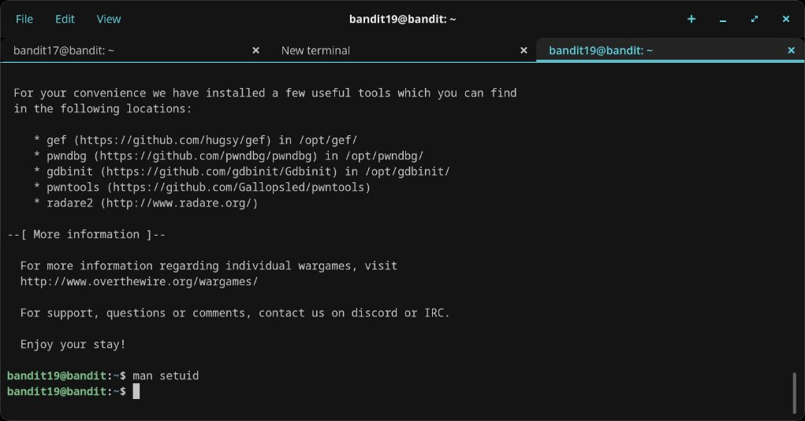
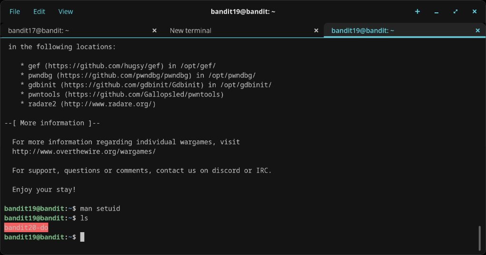
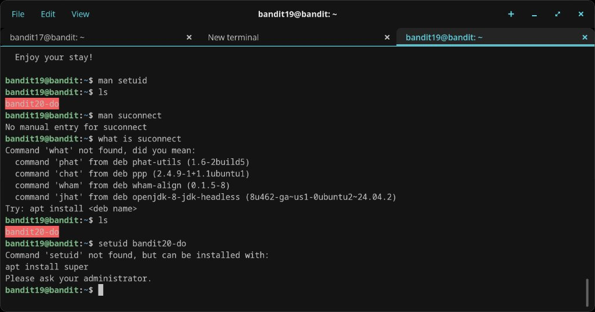
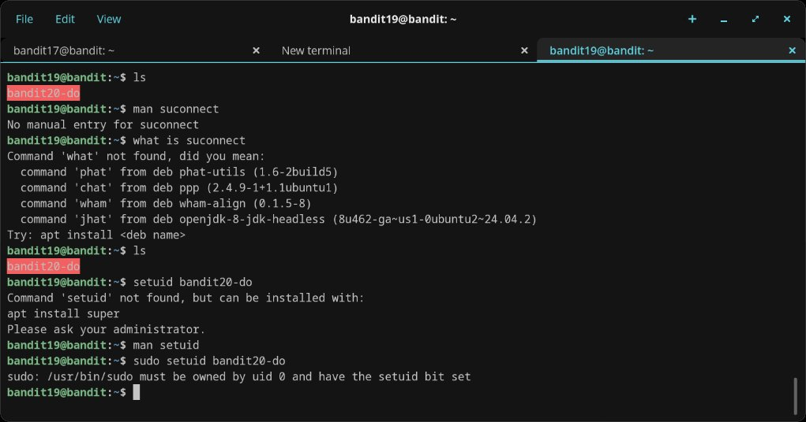
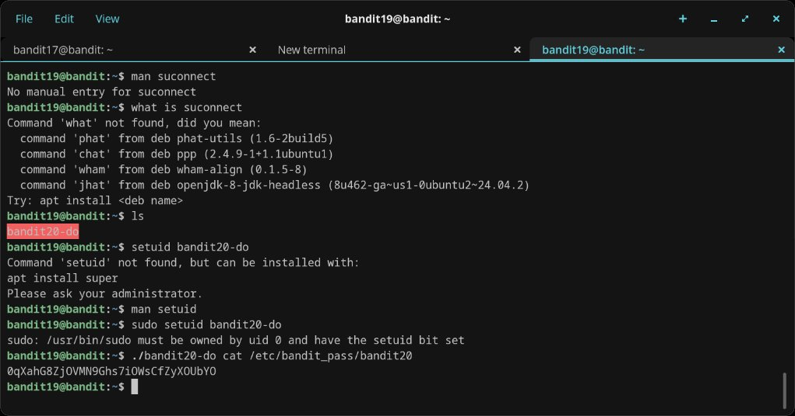

# Level 19 → 20

## Objective
Use the setuid binary in the home directory to access the password for the next level. Execute it without arguments to find out how to use it. The password is in the usual place (`/etc/bandit_pass`).

## Connection
```bash
ssh bandit19@bandit.labs.overthewire.org -p 2220
```
Password: `cGWpMaKXVwDUNgPAVJbWYuGHVn9zl3j8`

## Solution

### Step 1 — Research setuid
Started by reading the man page for setuid to understand the concept:

```bash
man setuid
```

### Step 2 — Find the binary
Listed the home directory:

```bash
ls
```

Found `bandit20-do` highlighted in the terminal output.

### Step 3 — Trial and error
Tried several approaches that didn't work:

- `man suconnect` — no manual entry
- `what is suconnect` — command not found (meant `whatis`, and `suconnect` is from a later level anyway)
- `setuid bandit20-do` — command `setuid` not found; it's a system call, not a command you run directly
- `man setuid` — re-read the man page
- `sudo setuid bandit20-do` — sudo error: `/usr/bin/sudo must be owned by uid 0 and have the setuid bit set`

The key realisation was that `bandit20-do` is already a setuid binary — you don't need to *apply* setuid to it, you just need to *execute* it with `./`.

### Step 4 — Run the binary correctly
```bash
./bandit20-do cat /etc/bandit_pass/bandit20
```

The binary executes `cat` as user bandit20, reading the password file that only bandit20 can access.

## Password Found
`0qXahG8ZjOVMN9Ghs7iOWsCfZyXOUbYO`

## What I Learned
- The setuid bit (`s` in permissions) allows a binary to run with the file owner's privileges, not the caller's
- `setuid` is a system call / permission attribute, not a command you type — the binary already has it set
- `sudo` wasn't available in the expected way on this system
- Running a binary in the current directory requires `./` prefix
- The `id` command can verify which user context a process is running under (`uid` vs `euid`)
- Setuid binaries are a common privilege escalation mechanism in Linux — and a common target in security assessments

## Screenshots





