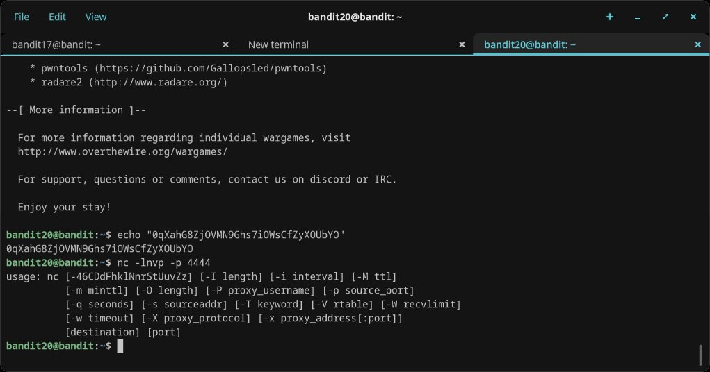
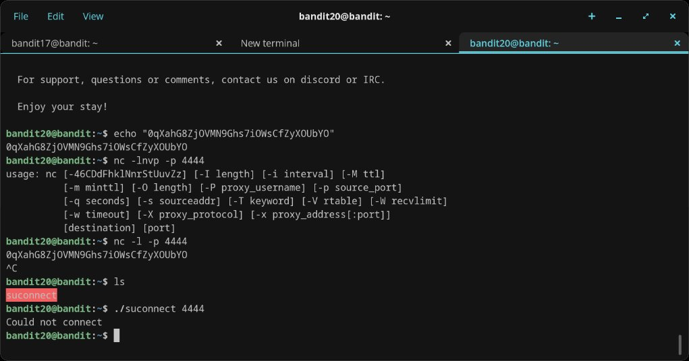
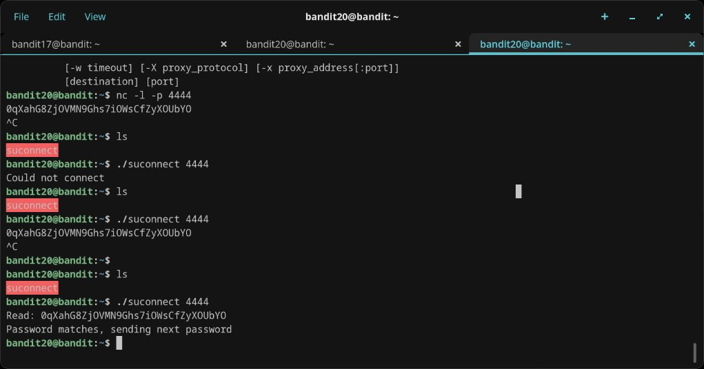

# Level 20 → 21

## Objective
Use a setuid binary called `suconnect` that connects to a port on localhost, reads a line, and if it matches the current level's password, sends back the next level's password. You need to set up a listener on that port yourself.

## Connection
```bash
ssh bandit20@bandit.labs.overthewire.org -p 2220
```
Password: `0qXahG8ZjOVMN9Ghs7iOWsCfZyXOUbYO`

## Solution

First, confirm the binary exists:
```bash
ls
./suconnect
```

Open two terminal tabs — both SSH'd in as `bandit20`. In the first tab, set up a netcat listener that serves the current password on a port:
```bash
echo "0qXahG8ZjOVMN9Ghs7iOWsCfZyXOUbYO" | nc -l -p 4444
```

In the second tab, run `suconnect` pointing at that port:
```bash
./suconnect 4444
```

`suconnect` reads the password from the listener, verifies it matches the level 20 password, and sends back the next password. The output shows:
```
Read: 0qXahG8ZjOVMN9Ghs7iOWsCfZyXOUbYO
Password matches, sending next password
```

Back in the first tab (the nc listener), the next password appears.

## Password Found
`EeoULMCra2q0dSkYj561DX7s1CpBuOBt`

## What I Learned
- How to use `nc -l -p <port>` to set up a basic TCP listener
- How setuid binaries can be used to authenticate and relay credentials
- The importance of running two concurrent sessions to coordinate a client/server interaction
- Difference between `nc -l -p` (standard) and `nc -lnvp` (verbose with no DNS) — the `-lnvp` variant wasn't available in this environment

## Screenshots




