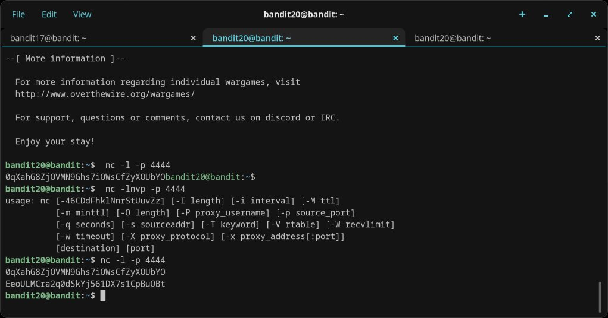

# Level 20 → 21

## Objective
Use a setuid binary called `suconnect` that connects to a port on localhost, reads a line, and if it matches the current level's password, sends back the next level's password. You need to set up a listener on that port yourself.

## Connection
```bash
ssh bandit20@bandit.labs.overthewire.org -p 2220
```
Password: `0qXahG8ZjOVMN9Ghs7iOWsCfZyXOUbYO`

## Solution

### Step 1 — Log in and orient
Logged into bandit20. Echoed the current password to confirm it, then listed files to find `suconnect`.

### Step 2 — First listener attempt (nc -lnvp)
Tried to start a netcat listener with verbose flags:

```bash
nc -lnvp -p 4444
```

This failed with a usage error — the `-lnvp` flag combination wasn't supported in this version of netcat.

### Step 3 — Second attempt (nc -l -p)
Switched to the simpler syntax:

```bash
nc -l -p 4444
```

The listener started and served the password, but when `./suconnect 4444` was run, it said `Could not connect` — the listener had already consumed the input and closed before `suconnect` could connect.

### Step 4 — Timing it right with two terminals
Opened two terminal tabs, both SSH'd into bandit20.

**Tab 1 (listener):** Set up a netcat listener that pipes the current password:
```bash
echo "0qXahG8ZjOVMN9Ghs7iOWsCfZyXOUbYO" | nc -l -p 4444
```

**Tab 2 (client):** Ran suconnect pointed at the same port:
```bash
./suconnect 4444
```

Output:
```
Read: 0qXahG8ZjOVMN9Ghs7iOWsCfZyXOUbYO
Password matches, sending next password
```

Back in the listener tab, the next password appeared.

### Step 5 — Successful run
On the final working attempt, the listener tab showed both the served password and the received next password:

```bash
nc -l -p 4444
0qXahG8ZjOVMN9Ghs7iOWsCfZyXOUbYO
EeoULMCra2q0dSkYj561DX7s1CpBuOBt
```

## Password Found
`EeoULMCra2q0dSkYj561DX7s1CpBuOBt`

## What I Learned
- How to use `nc -l -p <port>` to set up a basic TCP listener
- The `-lnvp` verbose flag combination isn't available in all netcat versions
- Timing matters — the listener must be active when the client connects
- How setuid binaries can be used to authenticate and relay credentials
- The importance of running two concurrent sessions to coordinate a client/server interaction
- Piping with `echo "password" | nc -l -p <port>` auto-serves content to the first connection

## Screenshots



